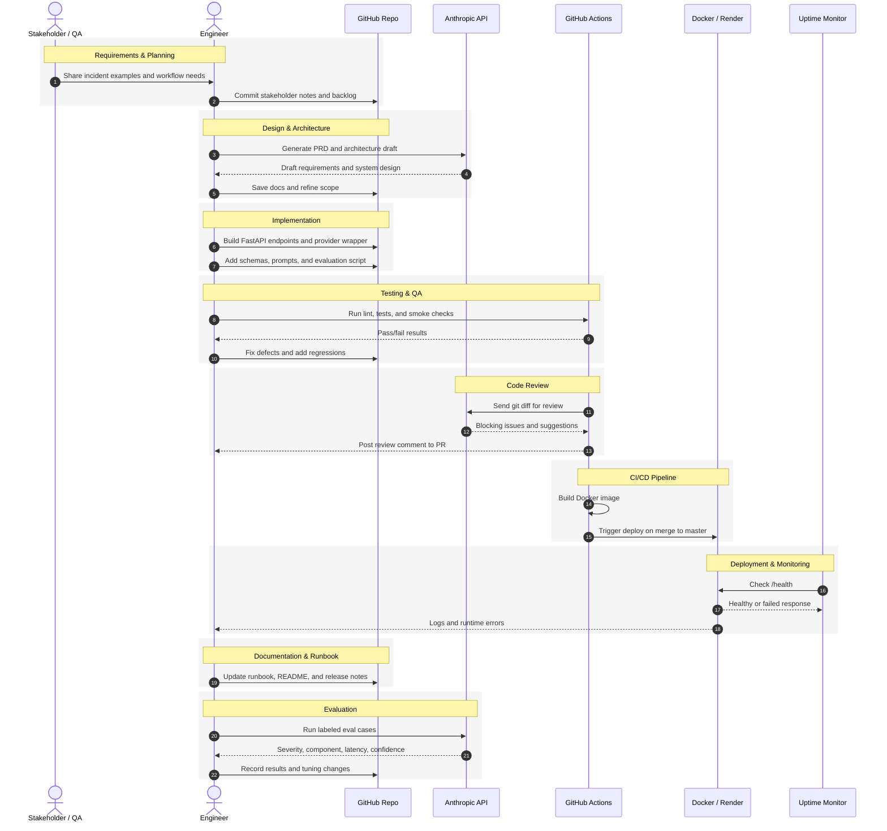
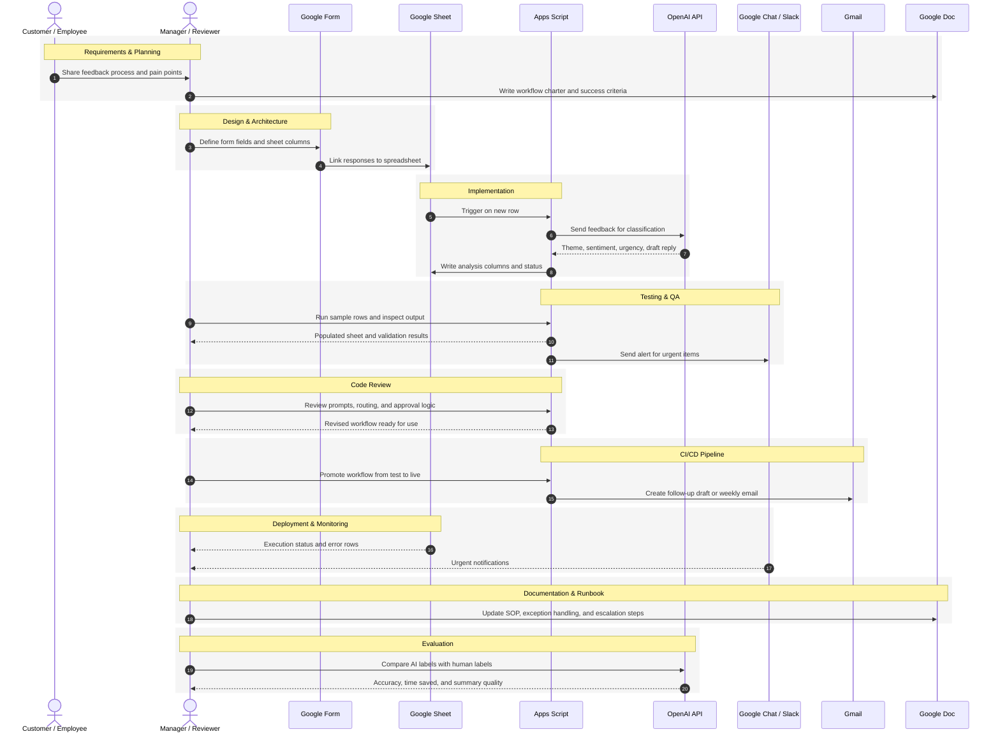
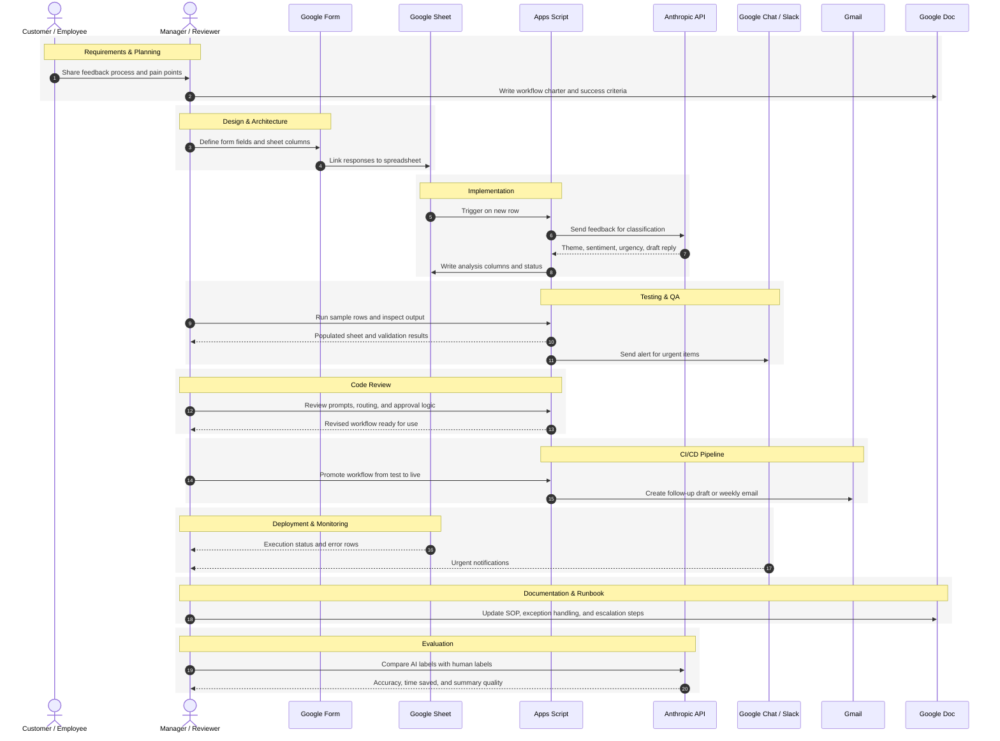

## 1) `technical_openai/`

```mermaid
sequenceDiagram
autonumber
actor Stakeholder as Stakeholder / QA
actor Engineer as Engineer
participant Repo as GitHub Repo
participant AI as OpenAI API
participant CI as GitHub Actions
participant Deploy as Docker / Render
participant Mon as Uptime Monitor

rect rgb(245,245,245)
  Note over Stakeholder,Engineer: Requirements & Planning
  Stakeholder->>Engineer: Share incident examples and workflow needs
  Engineer->>Repo: Commit stakeholder notes and backlog
end

rect rgb(245,245,245)
  Note over Engineer,Repo: Design & Architecture
  Engineer->>AI: Generate PRD and architecture draft
  AI-->>Engineer: Draft requirements and system design
  Engineer->>Repo: Save docs and refine scope
end

rect rgb(245,245,245)
  Note over Engineer,Repo: Implementation
  Engineer->>Repo: Build FastAPI endpoints and provider wrapper
  Engineer->>Repo: Add schemas, prompts, and evaluation script
end

rect rgb(245,245,245)
  Note over Engineer,CI: Testing & QA
  Engineer->>CI: Run lint, tests, and smoke checks
  CI-->>Engineer: Pass/fail results
  Engineer->>Repo: Fix defects and add regressions
end

rect rgb(245,245,245)
  Note over CI,AI: Code Review
  CI->>AI: Send git diff for review
  AI-->>CI: Blocking issues and suggestions
  CI-->>Engineer: Post review comment to PR
end

rect rgb(245,245,245)
  Note over CI,Deploy: CI/CD Pipeline
  CI->>CI: Build Docker image
  CI->>Deploy: Trigger deploy on merge to master
end

rect rgb(245,245,245)
  Note over Mon,Deploy: Deployment & Monitoring
  Mon->>Deploy: Check /health
  Deploy-->>Mon: Healthy or failed response
  Deploy-->>Engineer: Logs and runtime errors
end

rect rgb(245,245,245)
  Note over Engineer,Repo: Documentation & Runbook
  Engineer->>Repo: Update runbook, README, and release notes
end

rect rgb(245,245,245)
  Note over Engineer,AI: Evaluation
  Engineer->>AI: Run labeled eval cases
  AI-->>Engineer: Severity, component, latency, confidence
  Engineer->>Repo: Record results and tuning changes
end
```

## 2) `technical_claude/`

```mermaid
sequenceDiagram
autonumber
actor Stakeholder as Stakeholder / QA
actor Engineer as Engineer
participant Repo as GitHub Repo
participant AI as Anthropic API
participant CI as GitHub Actions
participant Deploy as Docker / Render
participant Mon as Uptime Monitor

rect rgb(245,245,245)
  Note over Stakeholder,Engineer: Requirements & Planning
  Stakeholder->>Engineer: Share incident examples and workflow needs
  Engineer->>Repo: Commit stakeholder notes and backlog
end

rect rgb(245,245,245)
  Note over Engineer,Repo: Design & Architecture
  Engineer->>AI: Generate PRD and architecture draft
  AI-->>Engineer: Draft requirements and system design
  Engineer->>Repo: Save docs and refine scope
end

rect rgb(245,245,245)
  Note over Engineer,Repo: Implementation
  Engineer->>Repo: Build FastAPI endpoints and provider wrapper
  Engineer->>Repo: Add schemas, prompts, and evaluation script
end

rect rgb(245,245,245)
  Note over Engineer,CI: Testing & QA
  Engineer->>CI: Run lint, tests, and smoke checks
  CI-->>Engineer: Pass/fail results
  Engineer->>Repo: Fix defects and add regressions
end

rect rgb(245,245,245)
  Note over CI,AI: Code Review
  CI->>AI: Send git diff for review
  AI-->>CI: Blocking issues and suggestions
  CI-->>Engineer: Post review comment to PR
end

rect rgb(245,245,245)
  Note over CI,Deploy: CI/CD Pipeline
  CI->>CI: Build Docker image
  CI->>Deploy: Trigger deploy on merge to master
end

rect rgb(245,245,245)
  Note over Mon,Deploy: Deployment & Monitoring
  Mon->>Deploy: Check /health
  Deploy-->>Mon: Healthy or failed response
  Deploy-->>Engineer: Logs and runtime errors
end

rect rgb(245,245,245)
  Note over Engineer,Repo: Documentation & Runbook
  Engineer->>Repo: Update runbook, README, and release notes
end

rect rgb(245,245,245)
  Note over Engineer,AI: Evaluation
  Engineer->>AI: Run labeled eval cases
  AI-->>Engineer: Severity, component, latency, confidence
  Engineer->>Repo: Record results and tuning changes
end
```

## 3) `non_technical_openai/`

```mermaid
sequenceDiagram
autonumber
actor User as Customer / Employee
actor Manager as Manager / Reviewer
participant Form as Google Form
participant Sheet as Google Sheet
participant Script as Apps Script
participant AI as OpenAI API
participant Slack as Google Chat / Slack
participant Gmail as Gmail
participant Doc as Google Doc

rect rgb(245,245,245)
  Note over User,Manager: Requirements & Planning
  User->>Manager: Share feedback process and pain points
  Manager->>Doc: Write workflow charter and success criteria
end

rect rgb(245,245,245)
  Note over Manager,Form: Design & Architecture
  Manager->>Form: Define form fields and sheet columns
  Form->>Sheet: Link responses to spreadsheet
end

rect rgb(245,245,245)
  Note over Sheet,Script: Implementation
  Sheet->>Script: Trigger on new row
  Script->>AI: Send feedback for classification
  AI-->>Script: Theme, sentiment, urgency, draft reply
  Script->>Sheet: Write analysis columns and status
end

rect rgb(245,245,245)
  Note over Script,Slack: Testing & QA
  Manager->>Script: Run sample rows and inspect output
  Script-->>Manager: Populated sheet and validation results
  Script->>Slack: Send alert for urgent items
end

rect rgb(245,245,245)
  Note over Manager,Script: Code Review
  Manager->>Script: Review prompts, routing, and approval logic
  Script-->>Manager: Revised workflow ready for use
end

rect rgb(245,245,245)
  Note over Script,Gmail: CI/CD Pipeline
  Manager->>Script: Promote workflow from test to live
  Script->>Gmail: Create follow-up draft or weekly email
end

rect rgb(245,245,245)
  Note over Sheet,Manager: Deployment & Monitoring
  Sheet-->>Manager: Execution status and error rows
  Slack-->>Manager: Urgent notifications
end

rect rgb(245,245,245)
  Note over Manager,Doc: Documentation & Runbook
  Manager->>Doc: Update SOP, exception handling, and escalation steps
end

rect rgb(245,245,245)
  Note over Manager,AI: Evaluation
  Manager->>AI: Compare AI labels with human labels
  AI-->>Manager: Accuracy, time saved, and summary quality
end
```

## 4) `non_technical_claude/`

```mermaid
sequenceDiagram
autonumber
actor User as Customer / Employee
actor Manager as Manager / Reviewer
participant Form as Google Form
participant Sheet as Google Sheet
participant Script as Apps Script
participant AI as Anthropic API
participant Slack as Google Chat / Slack
participant Gmail as Gmail
participant Doc as Google Doc

rect rgb(245,245,245)
  Note over User,Manager: Requirements & Planning
  User->>Manager: Share feedback process and pain points
  Manager->>Doc: Write workflow charter and success criteria
end

rect rgb(245,245,245)
  Note over Manager,Form: Design & Architecture
  Manager->>Form: Define form fields and sheet columns
  Form->>Sheet: Link responses to spreadsheet
end

rect rgb(245,245,245)
  Note over Sheet,Script: Implementation
  Sheet->>Script: Trigger on new row
  Script->>AI: Send feedback for classification
  AI-->>Script: Theme, sentiment, urgency, draft reply
  Script->>Sheet: Write analysis columns and status
end

rect rgb(245,245,245)
  Note over Script,Slack: Testing & QA
  Manager->>Script: Run sample rows and inspect output
  Script-->>Manager: Populated sheet and validation results
  Script->>Slack: Send alert for urgent items
end

rect rgb(245,245,245)
  Note over Manager,Script: Code Review
  Manager->>Script: Review prompts, routing, and approval logic
  Script-->>Manager: Revised workflow ready for use
end

rect rgb(245,245,245)
  Note over Script,Gmail: CI/CD Pipeline
  Manager->>Script: Promote workflow from test to live
  Script->>Gmail: Create follow-up draft or weekly email
end

rect rgb(245,245,245)
  Note over Sheet,Manager: Deployment & Monitoring
  Sheet-->>Manager: Execution status and error rows
  Slack-->>Manager: Urgent notifications
end

rect rgb(245,245,245)
  Note over Manager,Doc: Documentation & Runbook
  Manager->>Doc: Update SOP, exception handling, and escalation steps
end

rect rgb(245,245,245)
  Note over Manager,AI: Evaluation
  Manager->>AI: Compare AI labels with human labels
  AI-->>Manager: Accuracy, time saved, and summary quality
end
```
