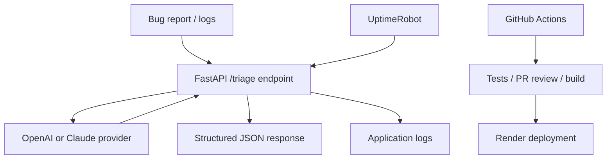
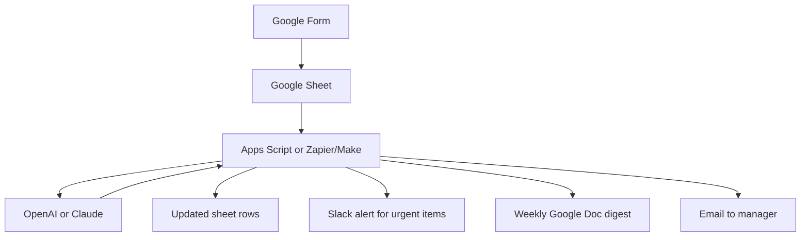
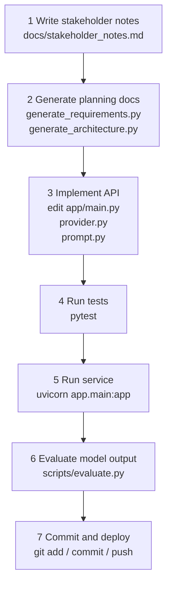
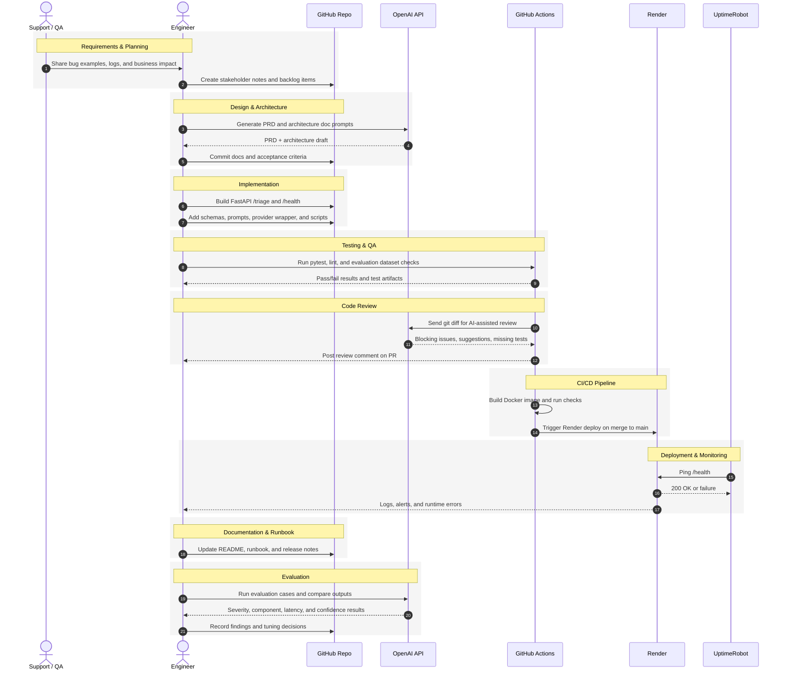
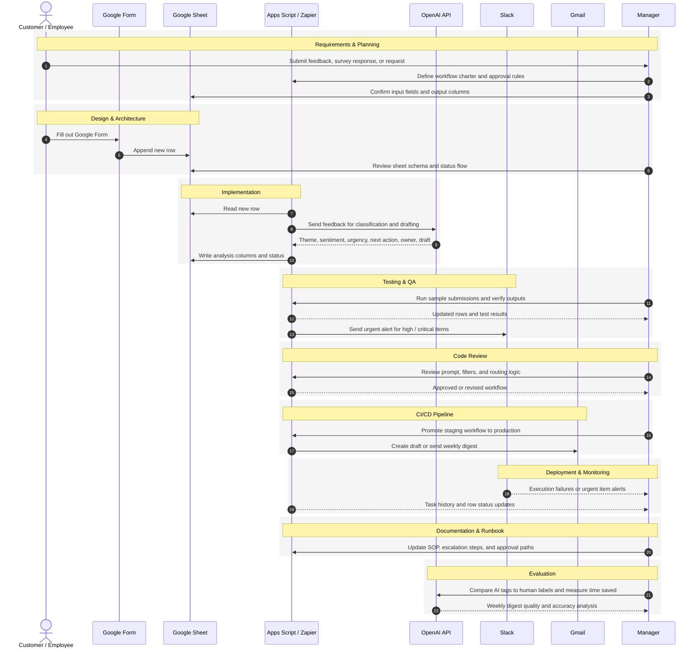

Below are two portfolio-ready personal projects that mirror real business workflows.

I designed them so you can build:

1. **One technical-user project**  
2. **One non-technical-user project**

And for **each** project, you will have **two separate implementations**:

- an **OpenAI / ChatGPT-only** version
- an **Anthropic / Claude-only** version

I also split each project into:

- **scripted/manual** methods: code/scripts you run directly
- **tooling-based** methods: GitHub Actions, Zapier, Make, Render, Apps Script triggers, etc.

That gives you realistic practice across the full SDLC:

- Requirements & Planning  
- Design & Architecture  
- Implementation  
- Testing & QA  
- Code Review  
- CI/CD Pipeline  
- Deployment  
- Monitoring & Logging  
- Documentation & Runbook  
- Evaluation  

---

# Before you start

## Business-safe defaults

Use these on both projects:

- **Do not send secrets, customer PII, or production credentials** to any model.
- Use **sample or sanitized data** while learning.
- Add **human approval** before anything customer-facing gets sent.
- Keep **OpenAI and Claude versions in separate repos or folders** so you can compare them independently.
- Put keys in:
  - `.env` for Python projects
  - **Script Properties** for Google Apps Script
  - **GitHub Secrets** / **Zapier Connections** / **Make Connections** for automations

## Suggested repo/folder layout

Create **four separate solutions** so they stay independent:

- `ai-incident-triage-openai/`
- `ai-incident-triage-claude/`
- `ai-feedback-hub-openai/`
- `ai-feedback-hub-claude/`

---

# Project 1 — Technical Users  
# AI Incident Triage & Release Notes API

## Why this project is good for business workflows

This simulates a very common engineering workflow:

- support or QA files a bug
- engineering needs quick structured triage
- release managers need a business-readable release note
- dev teams need tests, PR review, CI/CD, deploys, runbooks, and evaluation

You’ll practice:

- turning ambiguous requirements into a PRD
- architecture docs and ADR-style thinking
- API development
- automated testing
- AI-assisted code review
- CI/CD
- deployment and monitoring
- measurable evaluation

---

## What it does

You build a small API that accepts:

- issue title
- description
- logs
- changed files
- service name

And returns structured JSON with:

- severity
- probable component
- root cause hypothesis
- recommended fix
- test plan
- rollback plan
- release note
- confidence score

---

## Architecture



---

## Suggested backlog

Use this backlog in GitHub Issues or a spreadsheet:

1. Create stakeholder notes
2. Generate PRD
3. Generate architecture doc
4. Build FastAPI `/triage` and `/health`
5. Add unit tests
6. Add evaluation dataset
7. Add AI PR review workflow
8. Add CI build/test workflow
9. Deploy to Render
10. Add monitoring + runbook
11. Run evaluation and compare OpenAI vs Claude

---

## Common scaffold for both technical repos

Use this same file structure in both `ai-incident-triage-openai` and `ai-incident-triage-claude`.

```text
ai-incident-triage-<provider>/
  app/
    main.py
    prompt.py
    provider.py
    schemas.py
  data/
    eval_cases.jsonl
  docs/
    stakeholder_notes.md
    runbook.md
  scripts/
    generate_requirements.py
    generate_architecture.py
    review_diff.py
    evaluate.py
  tests/
    test_api.py
  .github/
    workflows/
      ci.yml
      pr-review.yml
      deploy.yml
  Dockerfile
  requirements.txt
  .env.example
```

---

## Common files for both technical repos

### `app/schemas.py`

```python
from typing import List, Literal
from pydantic import BaseModel, Field

Severity = Literal["low", "medium", "high", "critical"]
Component = Literal["frontend", "backend", "database", "auth", "infra", "unknown"]

class TriageRequest(BaseModel):
    title: str = Field(..., min_length=3)
    description: str
    logs: str = ""
    changed_files: List[str] = Field(default_factory=list)
    service_name: str = "unknown"

class TriageResponse(BaseModel):
    severity: Severity
    probable_component: Component
    root_cause_hypothesis: str
    recommended_fix: str
    test_plan: List[str] = Field(default_factory=list)
    rollback_plan: str
    release_note: str
    confidence: float = Field(ge=0.0, le=1.0)
```

### `app/prompt.py`

```python
TRIAGE_SYSTEM_PROMPT = """
You are a senior engineering triage assistant.

Return ONLY valid JSON with this exact schema:
{
  "severity": "low|medium|high|critical",
  "probable_component": "frontend|backend|database|auth|infra|unknown",
  "root_cause_hypothesis": "string",
  "recommended_fix": "string",
  "test_plan": ["string", "string"],
  "rollback_plan": "string",
  "release_note": "string",
  "confidence": 0.0
}

Rules:
- Be specific but concise.
- If evidence is weak, say "insufficient evidence" explicitly.
- confidence must be between 0 and 1.
- release_note should be understandable by product/support stakeholders.
"""
```

### `app/main.py`

```python
import logging
import os
from fastapi import FastAPI, HTTPException
from .schemas import TriageRequest, TriageResponse
from .provider import triage_issue

logging.basicConfig(
    level=os.getenv("LOG_LEVEL", "INFO"),
    format='{"time":"%(asctime)s","level":"%(levelname)s","message":"%(message)s"}'
)

app = FastAPI(title="AI Incident Triage API")

@app.get("/health")
def health():
    return {"status": "ok"}

@app.post("/triage", response_model=TriageResponse)
def triage(req: TriageRequest):
    try:
        result = triage_issue(req)
        validated = TriageResponse(**result)
        logging.info(
            'triage_success title="%s" severity="%s" component="%s"',
            req.title,
            validated.severity,
            validated.probable_component,
        )
        return validated
    except Exception as err:
        logging.exception("triage_failed")
        raise HTTPException(status_code=500, detail=f"triage failed: {err}")
```

### `tests/test_api.py`

```python
from fastapi.testclient import TestClient
from app.main import app

client = TestClient(app)

def test_health():
    r = client.get("/health")
    assert r.status_code == 200
    assert r.json() == {"status": "ok"}

def test_triage(monkeypatch):
    import app.main as main_module

    def fake_triage(_req):
        return {
            "severity": "high",
            "probable_component": "backend",
            "root_cause_hypothesis": "Null pointer after deploy",
            "recommended_fix": "Add null check and redeploy",
            "test_plan": ["Add unit test for missing payload", "Verify in staging"],
            "rollback_plan": "Roll back the most recent release",
            "release_note": "Improved API stability for failed requests.",
            "confidence": 0.84,
        }

    monkeypatch.setattr(main_module, "triage_issue", fake_triage)

    payload = {
        "title": "Users see 500 after deploy",
        "description": "Login endpoint returns 500 for some users",
        "logs": "AttributeError: 'NoneType' object has no attribute 'id'",
        "changed_files": ["api/login.py"],
        "service_name": "auth-service",
    }

    r = client.post("/triage", json=payload)
    assert r.status_code == 200
    assert r.json()["severity"] == "high"
    assert r.json()["probable_component"] == "backend"
```

### `scripts/evaluate.py`

```python
import json
import sys
import time
import requests

BASE_URL = sys.argv[1] if len(sys.argv) > 1 else "http://localhost:8000"

with open("data/eval_cases.jsonl", "r", encoding="utf-8") as f:
    cases = [json.loads(line) for line in f if line.strip()]

severity_hits = 0
component_hits = 0
latencies = []
failures = []

for case in cases:
    start = time.perf_counter()
    r = requests.post(f"{BASE_URL}/triage", json=case["input"], timeout=90)
    elapsed = time.perf_counter() - start
    latencies.append(elapsed)

    r.raise_for_status()
    pred = r.json()
    expected = case["expected"]

    severity_ok = pred["severity"] == expected["severity"]
    component_ok = pred["probable_component"] == expected["probable_component"]

    severity_hits += int(severity_ok)
    component_hits += int(component_ok)

    if not (severity_ok and component_ok):
        failures.append({
            "title": case["input"]["title"],
            "predicted": {
                "severity": pred["severity"],
                "probable_component": pred["probable_component"],
            },
            "expected": expected,
        })

summary = {
    "cases": len(cases),
    "severity_accuracy": round(severity_hits / len(cases), 3) if cases else 0,
    "component_accuracy": round(component_hits / len(cases), 3) if cases else 0,
    "avg_latency_seconds": round(sum(latencies) / len(latencies), 3) if latencies else 0,
    "failures": failures,
}

print(json.dumps(summary, indent=2))
```

### `data/eval_cases.jsonl`

```json
{"input":{"title":"Login fails for SSO users","description":"All Okta sign-ins return 500 after today's deploy","logs":"KeyError: oidc_audience","changed_files":["auth.py","sso_config.py"],"service_name":"auth-service"},"expected":{"severity":"critical","probable_component":"auth"}}
{"input":{"title":"Dashboard loads slowly","description":"Average load time increased from 2s to 9s for some users","logs":"SELECT caused full table scan","changed_files":["analytics_query.sql"],"service_name":"reporting"},"expected":{"severity":"medium","probable_component":"database"}}
{"input":{"title":"Checkout button misaligned on mobile","description":"On iPhone SE the CTA is partially off screen","logs":"","changed_files":["checkout.css"],"service_name":"web-frontend"},"expected":{"severity":"low","probable_component":"frontend"}}
```

### `Dockerfile`

```dockerfile
FROM python:3.11-slim

WORKDIR /app

COPY requirements.txt .
RUN pip install --no-cache-dir -r requirements.txt

COPY app app
COPY data data
COPY scripts scripts

CMD ["sh", "-c", "uvicorn app.main:app --host 0.0.0.0 --port ${PORT:-8000}"]
```

### `.github/workflows/ci.yml`

```yaml
name: ci

on:
  pull_request:
  push:
    branches: [main]

jobs:
  test-build:
    runs-on: ubuntu-latest
    steps:
      - uses: actions/checkout@v4

      - uses: actions/setup-python@v5
        with:
          python-version: "3.11"

      - run: pip install -r requirements.txt
      - run: ruff check .
      - run: pytest -q
      - run: docker build -t ai-incident-triage .
```

### `.github/workflows/deploy.yml`

```yaml
name: deploy

on:
  push:
    branches: [main]

jobs:
  deploy-render:
    runs-on: ubuntu-latest
    steps:
      - name: Trigger Render deploy
        run: curl -X POST "$RENDER_DEPLOY_HOOK_URL"
        env:
          RENDER_DEPLOY_HOOK_URL: ${{ secrets.RENDER_DEPLOY_HOOK_URL }}
```

### Example `docs/stakeholder_notes.md`

```markdown
# Stakeholder Notes

- Support and QA submit 10-20 bug reports per week.
- Engineers spend too much time rewriting bug tickets into structured triage notes.
- We need severity, probable component, root cause hypothesis, recommended next step, test plan, rollback plan, and a short release note.
- Output must be valid JSON.
- Must include /health, logs, tests, CI/CD, deployment, and a runbook.
- Human review is required before production action is taken.
```

---

# Technical Project — OpenAI / ChatGPT Solution

## `requirements.txt`

```text
fastapi
uvicorn[standard]
pydantic
openai
pytest
httpx
ruff
requests
```

## `.env.example`

```text
OPENAI_API_KEY=your_key_here
OPENAI_MODEL=gpt-4o-mini
LOG_LEVEL=INFO
```

## `app/provider.py`

```python
import json
import os
from openai import OpenAI
from .prompt import TRIAGE_SYSTEM_PROMPT
from .schemas import TriageRequest

def triage_issue(req: TriageRequest) -> dict:
    client = OpenAI(api_key=os.getenv("OPENAI_API_KEY"))
    model = os.getenv("OPENAI_MODEL", "gpt-4o-mini")

    user_prompt = f"""
Issue title: {req.title}
Service: {req.service_name}

Description:
{req.description}

Logs:
{req.logs}

Changed files:
{", ".join(req.changed_files) if req.changed_files else "N/A"}
"""

    resp = client.chat.completions.create(
        model=model,
        temperature=0.2,
        response_format={"type": "json_object"},
        messages=[
            {"role": "system", "content": TRIAGE_SYSTEM_PROMPT},
            {"role": "user", "content": user_prompt},
        ],
    )

    return json.loads(resp.choices[0].message.content)
```

## `scripts/generate_requirements.py`

```python
import os
import sys
from openai import OpenAI

if len(sys.argv) != 2:
    raise SystemExit("usage: python scripts/generate_requirements.py <stakeholder_notes.md>")

notes = open(sys.argv[1], "r", encoding="utf-8").read()
client = OpenAI(api_key=os.getenv("OPENAI_API_KEY"))
model = os.getenv("OPENAI_MODEL", "gpt-4o-mini")

prompt = f"""
Convert these stakeholder notes into a concise PRD in Markdown.

Required sections:
- Problem statement
- Users
- Goals
- Non-goals
- Functional requirements
- Non-functional requirements
- Risks
- Acceptance criteria
- KPIs
- Rollout plan

Stakeholder notes:
{notes}
"""

resp = client.chat.completions.create(
    model=model,
    temperature=0.2,
    messages=[
        {"role": "system", "content": "You are a product manager and delivery lead."},
        {"role": "user", "content": prompt},
    ],
)

print(resp.choices[0].message.content)
```

## `scripts/generate_architecture.py`

```python
import os
import sys
from openai import OpenAI

if len(sys.argv) != 2:
    raise SystemExit("usage: python scripts/generate_architecture.py <requirements.md>")

prd = open(sys.argv[1], "r", encoding="utf-8").read()
client = OpenAI(api_key=os.getenv("OPENAI_API_KEY"))
model = os.getenv("OPENAI_MODEL", "gpt-4o-mini")

prompt = f"""
Based on this PRD, write a lightweight architecture document in Markdown.

Required sections:
- Overview
- Components
- API contract
- Data flow
- Failure modes and mitigations
- Test strategy
- Rollout and rollback
- Mermaid diagram

PRD:
{prd}
"""

resp = client.chat.completions.create(
    model=model,
    temperature=0.2,
    messages=[
        {"role": "system", "content": "You are a staff engineer writing an architecture doc."},
        {"role": "user", "content": prompt},
    ],
)

print(resp.choices[0].message.content)
```

## `scripts/review_diff.py`

```python
import os
import sys
from openai import OpenAI

if len(sys.argv) != 2:
    raise SystemExit("usage: python scripts/review_diff.py <diff_file>")

diff = open(sys.argv[1], "r", encoding="utf-8").read()[:120000]
client = OpenAI(api_key=os.getenv("OPENAI_API_KEY"))
model = os.getenv("OPENAI_MODEL", "gpt-4o-mini")

prompt = f"""
Review this git diff like a senior software engineer.

Focus on:
- correctness
- breaking changes
- security
- missing tests
- readability
- rollback risk

Return Markdown with sections:
- Summary
- Blocking Issues
- Suggestions
- Missing Tests

Diff:
{diff}
"""

resp = client.chat.completions.create(
    model=model,
    temperature=0.1,
    messages=[
        {"role": "system", "content": "You are a strict but practical code reviewer."},
        {"role": "user", "content": prompt},
    ],
)

print(resp.choices[0].message.content)
```

## `.github/workflows/pr-review.yml`

```yaml
name: ai-pr-review

on:
  pull_request:
    types: [opened, synchronize, reopened]

permissions:
  contents: read
  pull-requests: write

jobs:
  review:
    runs-on: ubuntu-latest
    steps:
      - uses: actions/checkout@v4
        with:
          fetch-depth: 0

      - uses: actions/setup-python@v5
        with:
          python-version: "3.11"

      - run: pip install -r requirements.txt

      - name: Build diff
        run: |
          git fetch origin ${{ github.base_ref }} --depth=1
          git diff origin/${{ github.base_ref }}...HEAD > pr.diff

      - name: Generate AI review
        run: python scripts/review_diff.py pr.diff > review.md
        env:
          OPENAI_API_KEY: ${{ secrets.OPENAI_API_KEY }}
          OPENAI_MODEL: gpt-4o-mini

      - uses: marocchino/sticky-pull-request-comment@v2
        with:
          path: review.md
```

## How to run the OpenAI technical solution

```bash
python -m venv .venv
source .venv/bin/activate   # Windows: .venv\Scripts\activate
pip install -r requirements.txt
cp .env.example .env
uvicorn app.main:app --env-file .env --reload
```

Test it:

```bash
curl -X POST http://localhost:8000/triage \
  -H "Content-Type: application/json" \
  -d '{
    "title": "SSO users get 500 after deploy",
    "description": "After the latest auth release, all Okta users fail login",
    "logs": "KeyError: oidc_audience",
    "changed_files": ["auth.py","sso_config.py"],
    "service_name": "auth-service"
  }'
```

Generate planning docs:

```bash
python scripts/generate_requirements.py docs/stakeholder_notes.md > docs/requirements.md
python scripts/generate_architecture.py docs/requirements.md > docs/architecture.md
```

Run tests and evaluation:

```bash
pytest -q
python scripts/evaluate.py http://localhost:8000
```

Deploy locally with Docker:

```bash
docker build -t triage-openai .
docker run --rm -p 8000:8000 --env-file .env triage-openai
```

---

# Technical Project — Anthropic / Claude Solution

## `requirements.txt`

```text
fastapi
uvicorn[standard]
pydantic
anthropic
pytest
httpx
ruff
requests
```

## `.env.example`

```text
ANTHROPIC_API_KEY=your_key_here
ANTHROPIC_MODEL=claude-3-5-sonnet-20240620
LOG_LEVEL=INFO
```

## `app/provider.py`

```python
import json
import os
import re
from anthropic import Anthropic
from .prompt import TRIAGE_SYSTEM_PROMPT
from .schemas import TriageRequest

def extract_json(text: str) -> dict:
    match = re.search(r"\{.*\}", text, re.S)
    if not match:
        raise ValueError(f"No JSON found in model output: {text}")
    return json.loads(match.group(0))

def triage_issue(req: TriageRequest) -> dict:
    client = Anthropic(api_key=os.getenv("ANTHROPIC_API_KEY"))
    model = os.getenv("ANTHROPIC_MODEL", "claude-3-5-sonnet-20240620")

    user_prompt = f"""
Analyze this issue and return JSON only.

Issue title: {req.title}
Service: {req.service_name}

Description:
{req.description}

Logs:
{req.logs}

Changed files:
{", ".join(req.changed_files) if req.changed_files else "N/A"}
"""

    resp = client.messages.create(
        model=model,
        max_tokens=900,
        temperature=0.2,
        system=TRIAGE_SYSTEM_PROMPT + "\nReturn JSON only.",
        messages=[{"role": "user", "content": user_prompt}],
    )

    text = "".join(block.text for block in resp.content if getattr(block, "type", "") == "text")
    return extract_json(text)
```

## `scripts/generate_requirements.py`

```python
import os
import sys
from anthropic import Anthropic

if len(sys.argv) != 2:
    raise SystemExit("usage: python scripts/generate_requirements.py <stakeholder_notes.md>")

notes = open(sys.argv[1], "r", encoding="utf-8").read()
client = Anthropic(api_key=os.getenv("ANTHROPIC_API_KEY"))
model = os.getenv("ANTHROPIC_MODEL", "claude-3-5-sonnet-20240620")

prompt = f"""
Convert these stakeholder notes into a concise PRD in Markdown.

Required sections:
- Problem statement
- Users
- Goals
- Non-goals
- Functional requirements
- Non-functional requirements
- Risks
- Acceptance criteria
- KPIs
- Rollout plan

Stakeholder notes:
{notes}
"""

resp = client.messages.create(
    model=model,
    max_tokens=1500,
    temperature=0.2,
    system="You are a product manager and delivery lead.",
    messages=[{"role": "user", "content": prompt}],
)

print("".join(block.text for block in resp.content if getattr(block, "type", "") == "text"))
```

## `scripts/generate_architecture.py`

```python
import os
import sys
from anthropic import Anthropic

if len(sys.argv) != 2:
    raise SystemExit("usage: python scripts/generate_architecture.py <requirements.md>")

prd = open(sys.argv[1], "r", encoding="utf-8").read()
client = Anthropic(api_key=os.getenv("ANTHROPIC_API_KEY"))
model = os.getenv("ANTHROPIC_MODEL", "claude-3-5-sonnet-20240620")

prompt = f"""
Based on this PRD, write a lightweight architecture document in Markdown.

Required sections:
- Overview
- Components
- API contract
- Data flow
- Failure modes and mitigations
- Test strategy
- Rollout and rollback
- Mermaid diagram

PRD:
{prd}
"""

resp = client.messages.create(
    model=model,
    max_tokens=1800,
    temperature=0.2,
    system="You are a staff engineer writing an architecture doc.",
    messages=[{"role": "user", "content": prompt}],
)

print("".join(block.text for block in resp.content if getattr(block, "type", "") == "text"))
```

## `scripts/review_diff.py`

```python
import os
import sys
from anthropic import Anthropic

if len(sys.argv) != 2:
    raise SystemExit("usage: python scripts/review_diff.py <diff_file>")

diff = open(sys.argv[1], "r", encoding="utf-8").read()[:120000]
client = Anthropic(api_key=os.getenv("ANTHROPIC_API_KEY"))
model = os.getenv("ANTHROPIC_MODEL", "claude-3-5-sonnet-20240620")

prompt = f"""
Review this git diff like a senior software engineer.

Focus on:
- correctness
- breaking changes
- security
- missing tests
- readability
- rollback risk

Return Markdown with sections:
- Summary
- Blocking Issues
- Suggestions
- Missing Tests

Diff:
{diff}
"""

resp = client.messages.create(
    model=model,
    max_tokens=1600,
    temperature=0.1,
    system="You are a strict but practical code reviewer.",
    messages=[{"role": "user", "content": prompt}],
)

print("".join(block.text for block in resp.content if getattr(block, "type", "") == "text"))
```

## `.github/workflows/pr-review.yml`

```yaml
name: ai-pr-review

on:
  pull_request:
    types: [opened, synchronize, reopened]

permissions:
  contents: read
  pull-requests: write

jobs:
  review:
    runs-on: ubuntu-latest
    steps:
      - uses: actions/checkout@v4
        with:
          fetch-depth: 0

      - uses: actions/setup-python@v5
        with:
          python-version: "3.11"

      - run: pip install -r requirements.txt

      - name: Build diff
        run: |
          git fetch origin ${{ github.base_ref }} --depth=1
          git diff origin/${{ github.base_ref }}...HEAD > pr.diff

      - name: Generate AI review
        run: python scripts/review_diff.py pr.diff > review.md
        env:
          ANTHROPIC_API_KEY: ${{ secrets.ANTHROPIC_API_KEY }}
          ANTHROPIC_MODEL: claude-3-5-sonnet-20240620

      - uses: marocchino/sticky-pull-request-comment@v2
        with:
          path: review.md
```

## How to run the Claude technical solution

Same as the OpenAI version, but use the Anthropic repo and env vars:

```bash
python -m venv .venv
source .venv/bin/activate
pip install -r requirements.txt
cp .env.example .env
uvicorn app.main:app --env-file .env --reload
pytest -q
python scripts/generate_requirements.py docs/stakeholder_notes.md > docs/requirements.md
python scripts/generate_architecture.py docs/requirements.md > docs/architecture.md
python scripts/evaluate.py http://localhost:8000
```

---

## Technical project SDLC map

This SDLC map applies to **both** technical implementations.

| SDLC Step | Scripted/manual approach | Tooling-based approach |
|---|---|---|
| Requirements & Planning | `docs/stakeholder_notes.md` + `generate_requirements.py` | GitHub Issues, milestones, GitHub Project board |
| Design & Architecture | `generate_architecture.py` → `docs/architecture.md` | PR review of architecture doc, Mermaid diagram in repo |
| Implementation | FastAPI app files | branch-per-feature workflow, PR template |
| Testing & QA | `pytest`, `curl`, `scripts/evaluate.py` | GitHub Actions CI required before merge |
| Code Review | `scripts/review_diff.py` locally or in terminal | AI PR review workflow comments + human approval |
| CI/CD Pipeline | local Docker build and manual deploy hook | GitHub Actions build/test + Render deploy |
| Deployment | `docker build` / `docker run` | auto deploy on merge to `main` |
| Monitoring & Logging | structured stdout logs, `/health` | Render logs, UptimeRobot, Better Stack optional |
| Documentation & Runbook | `README.md`, `docs/runbook.md` | repo wiki / release notes / PR templates |
| Evaluation | `data/eval_cases.jsonl` + `scripts/evaluate.py` | scheduled weekly evaluation job if desired |

---

## Technical project tooling-based extras

These are the “modern business workflow” pieces most employers care about:

### 1. Requirements & backlog tooling
Use GitHub Issues with labels:

- `feature`
- `bug`
- `infra`
- `docs`
- `evaluation`

### 2. Branch protection
Require:

- passing CI
- at least 1 review
- no direct pushes to `main`

### 3. Deployment
Use **Render**:

1. Push repo to GitHub
2. Create a Render Web Service from the repo
3. Set env vars:
   - `OPENAI_API_KEY` or `ANTHROPIC_API_KEY`
   - `OPENAI_MODEL` or `ANTHROPIC_MODEL`
4. Set health check path to `/health`
5. Copy Render Deploy Hook URL into GitHub secret `RENDER_DEPLOY_HOOK_URL`

### 4. Monitoring
Use:

- **UptimeRobot** to ping `/health`
- Render logs for request failures
- provider usage dashboards for token and cost tracking

### 5. Runbook template (`docs/runbook.md`)
Keep this short and operational:

```markdown
# Runbook

## Health check
GET /health should return 200.

## Common failures
1. 401/403 -> API key missing or invalid
2. 500 with JSON parsing error -> inspect raw model output, tighten prompt, add regression test
3. Latency spike -> switch to smaller model or reduce prompt size

## Rollback
- Revert last commit
- Merge fix or redeploy previous Render version

## Escalation
- Open incident issue
- Attach logs
- Add failing sample to data/eval_cases.jsonl
```

---

# Project 2 — Non-Technical Users  
# AI Feedback Ops Hub

## Why this project is good for business workflows

This simulates a common operations workflow for:

- customer success
- product ops
- HR surveys
- internal feedback intake
- sales / account management digests

You’ll practice:

- workflow design
- approval gates
- spreadsheet-driven operations
- low-code automation
- monitoring business processes
- documenting SOPs
- evaluating quality and time saved

---

## What it does

You build a workflow that:

1. collects feedback from a Google Form or sheet
2. classifies each item by:
   - theme
   - sentiment
   - urgency
   - next action
   - owner suggestion
3. drafts a follow-up message
4. flags urgent items
5. produces a weekly summary doc/email

---

## Architecture



---

## Recommended Google Sheet columns

Create or link a form so the sheet has:

- **A** Timestamp
- **B** Customer
- **C** Channel
- **D** Feedback

The script will add:

- **E** Theme
- **F** Sentiment
- **G** Urgency
- **H** Next Action
- **I** Owner Suggestion
- **J** Follow-up Draft
- **K** Status

---

## Suggested backlog

1. Define workflow charter
2. Create form and sheet
3. Add Apps Script
4. Test with 5 sample submissions
5. Add weekly digest
6. Add Slack alerts
7. Add `clasp` repo and CI/CD
8. Add no-code version in Zapier or Make
9. Document SOP / runbook
10. Evaluate accuracy and time saved

---

## Planning prompts for non-technical users

Use these directly in ChatGPT or Claude web UI if you want a no-code planning phase.

### Requirements & Planning prompt

```text
You are an operations analyst. Turn the notes below into a workflow charter with:
- objective
- stakeholders
- input fields
- output fields
- approval steps
- exception paths
- KPIs
- rollout plan
- risks and mitigations
```

### Design & Architecture prompt

```text
Design a process map for a Google Form -> Google Sheet -> AI classification -> urgent alert -> weekly digest workflow.
Include:
- actors
- systems
- data fields
- business rules
- approval points
- failure handling
- reporting cadence
```

---

# Non-Technical Project — Shared Apps Script Helpers

Create **two separate Apps Script projects**:

- one for OpenAI
- one for Claude

In each project, paste the shared helper code below, then paste the provider-specific block after it.

## Shared `Code.gs` helpers

```javascript
const INPUT_SHEET = 'Form Responses 1';

function getProp_(name) {
  const value = PropertiesService.getScriptProperties().getProperty(name);
  if (!value) throw new Error('Missing Script Property: ' + name);
  return value;
}

function normalizeKey_(text) {
  return String(text).trim().toLowerCase().replace(/[^a-z0-9]+/g, '_');
}

function extractJson_(text) {
  const start = text.indexOf('{');
  const end = text.lastIndexOf('}');
  if (start === -1 || end === -1) {
    throw new Error('No JSON found in model output: ' + text);
  }
  return JSON.parse(text.substring(start, end + 1));
}

function ensureHttpOk_(response) {
  const code = response.getResponseCode();
  if (code >= 300) {
    throw new Error('HTTP ' + code + ': ' + response.getContentText());
  }
}

function prepareOutputColumns_() {
  const sheet = SpreadsheetApp.getActiveSpreadsheet().getSheetByName(INPUT_SHEET);
  const headers = ['Theme', 'Sentiment', 'Urgency', 'Next Action', 'Owner Suggestion', 'Follow-up Draft', 'Status'];
  sheet.getRange(1, 5, 1, headers.length).setValues([headers]);
}

function rowToObject_(headers, values) {
  const obj = {};
  headers.forEach((h, i) => {
    obj[normalizeKey_(h)] = values[i];
  });
  return obj;
}

function writeAnalysis_(sheet, row, result) {
  sheet.getRange(row, 5, 1, 6).setValues([[
    result.theme || '',
    result.sentiment || '',
    result.urgency || '',
    result.next_action || '',
    result.owner_suggestion || '',
    result.follow_up_email || ''
  ]]);
  sheet.getRange(row, 11).setValue('PROCESSED');
}

function postSlackAlert_(message) {
  const webhook = PropertiesService.getScriptProperties().getProperty('SLACK_WEBHOOK_URL');
  if (!webhook) return;

  UrlFetchApp.fetch(webhook, {
    method: 'post',
    contentType: 'application/json',
    payload: JSON.stringify({ text: message }),
    muteHttpExceptions: true
  });
}

function deleteAllTriggers_() {
  ScriptApp.getProjectTriggers().forEach(trigger => ScriptApp.deleteTrigger(trigger));
}

function processFeedbackRow_(sheet, row, analyzerFn) {
  const headers = sheet.getRange(1, 1, 1, 4).getValues()[0];
  const values = sheet.getRange(row, 1, 1, 4).getValues()[0];
  const record = rowToObject_(headers, values);

  const result = analyzerFn(record);
  writeAnalysis_(sheet, row, result);

  const urgency = String(result.urgency || '').toLowerCase();
  if (urgency === 'high' || urgency === 'critical') {
    postSlackAlert_(
      'Urgent feedback detected\n' +
      'Customer: ' + (record.customer || 'Unknown') + '\n' +
      'Channel: ' + (record.channel || 'Unknown') + '\n' +
      'Feedback: ' + (record.feedback || '')
    );
  }
}

function buildWeeklyRecords_() {
  const sheet = SpreadsheetApp.getActiveSpreadsheet().getSheetByName(INPUT_SHEET);
  const rows = sheet.getDataRange().getValues();
  const headers = rows[0];
  const cutoff = Date.now() - 7 * 24 * 60 * 60 * 1000;

  return rows
    .slice(1)
    .filter(row => new Date(row[0]).getTime() >= cutoff)
    .map(row => rowToObject_(headers, row));
}

function writeWeeklyDoc_(title, summary) {
  const doc = DocumentApp.create(title);
  doc.getBody().appendParagraph(summary);
  doc.saveAndClose();
  return doc.getUrl();
}

function emailWeeklyDigest_(summary, docUrl) {
  const managerEmail = getProp_('MANAGER_EMAIL');
  const body = summary + '\n\nGoogle Doc: ' + docUrl;
  GmailApp.sendEmail(managerEmail, 'Weekly Feedback Digest', body);
}
```

---

# Non-Technical Project — OpenAI / ChatGPT Scripted Solution

## Provider-specific `Code.gs` block for OpenAI

Paste this **after** the shared helpers.

```javascript
function onFormSubmitOpenAI(e) {
  const sheet = e.range.getSheet();
  const row = e.range.getRow();

  try {
    processFeedbackRow_(sheet, row, analyzeWithOpenAI);
  } catch (err) {
    sheet.getRange(row, 11).setValue('MANUAL_REVIEW');
    Logger.log(err.stack || err);
    const email = PropertiesService.getScriptProperties().getProperty('MANAGER_EMAIL');
    if (email) GmailApp.sendEmail(email, 'OpenAI Feedback Hub Error', String(err));
  }
}

function testOpenAIOnLastRow() {
  const sheet = SpreadsheetApp.getActiveSpreadsheet().getSheetByName(INPUT_SHEET);
  processFeedbackRow_(sheet, sheet.getLastRow(), analyzeWithOpenAI);
}

function setupTriggersOpenAI() {
  deleteAllTriggers_();
  prepareOutputColumns_();

  ScriptApp.newTrigger('onFormSubmitOpenAI')
    .forSpreadsheet(SpreadsheetApp.getActive())
    .onFormSubmit()
    .create();

  ScriptApp.newTrigger('weeklyDigestOpenAI')
    .timeBased()
    .onWeekDay(ScriptApp.WeekDay.MONDAY)
    .atHour(8)
    .create();
}

function analyzeWithOpenAI(record) {
  const apiKey = getProp_('OPENAI_API_KEY');
  const model = PropertiesService.getScriptProperties().getProperty('OPENAI_MODEL') || 'gpt-4o-mini';

  const payload = {
    model: model,
    temperature: 0.2,
    response_format: { type: 'json_object' },
    messages: [
      {
        role: 'system',
        content: 'You are a customer operations analyst. Return JSON with keys: theme, sentiment, urgency, next_action, owner_suggestion, follow_up_email. sentiment must be one of positive, neutral, negative. urgency must be one of low, medium, high, critical.'
      },
      {
        role: 'user',
        content: JSON.stringify(record, null, 2)
      }
    ]
  };

  const response = UrlFetchApp.fetch('https://api.openai.com/v1/chat/completions', {
    method: 'post',
    contentType: 'application/json',
    headers: {
      Authorization: 'Bearer ' + apiKey
    },
    payload: JSON.stringify(payload),
    muteHttpExceptions: true
  });

  ensureHttpOk_(response);
  const data = JSON.parse(response.getContentText());
  return JSON.parse(data.choices[0].message.content);
}

function summarizeWithOpenAI(records) {
  const apiKey = getProp_('OPENAI_API_KEY');
  const model = PropertiesService.getScriptProperties().getProperty('OPENAI_MODEL') || 'gpt-4o-mini';

  const payload = {
    model: model,
    temperature: 0.2,
    messages: [
      {
        role: 'system',
        content: 'You are a business operations analyst. Write a concise weekly digest with sections: Top Themes, Urgent Items, Recommended Actions, Risks, and 3 representative quotes. Keep it under 400 words.'
      },
      {
        role: 'user',
        content: JSON.stringify(records, null, 2)
      }
    ]
  };

  const response = UrlFetchApp.fetch('https://api.openai.com/v1/chat/completions', {
    method: 'post',
    contentType: 'application/json',
    headers: {
      Authorization: 'Bearer ' + apiKey
    },
    payload: JSON.stringify(payload),
    muteHttpExceptions: true
  });

  ensureHttpOk_(response);
  const data = JSON.parse(response.getContentText());
  return data.choices[0].message.content;
}

function weeklyDigestOpenAI() {
  const records = buildWeeklyRecords_();
  const summary = summarizeWithOpenAI(records);
  const title = 'Weekly Feedback Digest - ' +
    Utilities.formatDate(new Date(), Session.getScriptTimeZone(), 'yyyy-MM-dd');
  const docUrl = writeWeeklyDoc_(title, summary);
  emailWeeklyDigest_(summary, docUrl);
}
```

## Script Properties to set

In Apps Script:

- `OPENAI_API_KEY`
- `OPENAI_MODEL` = `gpt-4o-mini` (optional)
- `MANAGER_EMAIL`
- `SLACK_WEBHOOK_URL` (optional)

## How to deploy the OpenAI Apps Script solution

1. Create a Google Form with fields:
   - Customer
   - Channel
   - Feedback
2. Link it to a Google Sheet
3. Open **Extensions → Apps Script**
4. Paste:
   - the shared helper block
   - the OpenAI block
5. In **Project Settings**, add Script Properties
6. Run `setupTriggersOpenAI()` once
7. Authorize the script
8. Submit a test form entry
9. Check that columns E–K fill automatically

## How to test it

- Submit one positive feedback example
- Submit one ambiguous example
- Submit one urgent/negative example
- Confirm:
  - theme/sentiment/urgency are populated
  - status becomes `PROCESSED`
  - urgent item posts Slack alert if webhook exists
  - weekly digest can be run manually from the editor

---

# Non-Technical Project — Anthropic / Claude Scripted Solution

## Provider-specific `Code.gs` block for Claude

Paste this **after** the shared helpers in a separate Apps Script project.

```javascript
function onFormSubmitClaude(e) {
  const sheet = e.range.getSheet();
  const row = e.range.getRow();

  try {
    processFeedbackRow_(sheet, row, analyzeWithClaude);
  } catch (err) {
    sheet.getRange(row, 11).setValue('MANUAL_REVIEW');
    Logger.log(err.stack || err);
    const email = PropertiesService.getScriptProperties().getProperty('MANAGER_EMAIL');
    if (email) GmailApp.sendEmail(email, 'Claude Feedback Hub Error', String(err));
  }
}

function testClaudeOnLastRow() {
  const sheet = SpreadsheetApp.getActiveSpreadsheet().getSheetByName(INPUT_SHEET);
  processFeedbackRow_(sheet, sheet.getLastRow(), analyzeWithClaude);
}

function setupTriggersClaude() {
  deleteAllTriggers_();
  prepareOutputColumns_();

  ScriptApp.newTrigger('onFormSubmitClaude')
    .forSpreadsheet(SpreadsheetApp.getActive())
    .onFormSubmit()
    .create();

  ScriptApp.newTrigger('weeklyDigestClaude')
    .timeBased()
    .onWeekDay(ScriptApp.WeekDay.MONDAY)
    .atHour(8)
    .create();
}

function analyzeWithClaude(record) {
  const apiKey = getProp_('ANTHROPIC_API_KEY');
  const model = PropertiesService.getScriptProperties().getProperty('ANTHROPIC_MODEL') || 'claude-3-5-sonnet-20240620';

  const payload = {
    model: model,
    max_tokens: 800,
    temperature: 0.2,
    system: 'You are a customer operations analyst. Return JSON only with keys: theme, sentiment, urgency, next_action, owner_suggestion, follow_up_email. sentiment must be one of positive, neutral, negative. urgency must be one of low, medium, high, critical.',
    messages: [
      {
        role: 'user',
        content: JSON.stringify(record, null, 2)
      }
    ]
  };

  const response = UrlFetchApp.fetch('https://api.anthropic.com/v1/messages', {
    method: 'post',
    contentType: 'application/json',
    headers: {
      'x-api-key': apiKey,
      'anthropic-version': '2023-06-01'
    },
    payload: JSON.stringify(payload),
    muteHttpExceptions: true
  });

  ensureHttpOk_(response);
  const data = JSON.parse(response.getContentText());
  const text = data.content.map(block => block.text || '').join('');
  return extractJson_(text);
}

function summarizeWithClaude(records) {
  const apiKey = getProp_('ANTHROPIC_API_KEY');
  const model = PropertiesService.getScriptProperties().getProperty('ANTHROPIC_MODEL') || 'claude-3-5-sonnet-20240620';

  const payload = {
    model: model,
    max_tokens: 1200,
    temperature: 0.2,
    system: 'You are a business operations analyst. Write a concise weekly digest with sections: Top Themes, Urgent Items, Recommended Actions, Risks, and 3 representative quotes. Keep it under 400 words.',
    messages: [
      {
        role: 'user',
        content: JSON.stringify(records, null, 2)
      }
    ]
  };

  const response = UrlFetchApp.fetch('https://api.anthropic.com/v1/messages', {
    method: 'post',
    contentType: 'application/json',
    headers: {
      'x-api-key': apiKey,
      'anthropic-version': '2023-06-01'
    },
    payload: JSON.stringify(payload),
    muteHttpExceptions: true
  });

  ensureHttpOk_(response);
  const data = JSON.parse(response.getContentText());
  return data.content.map(block => block.text || '').join('');
}

function weeklyDigestClaude() {
  const records = buildWeeklyRecords_();
  const summary = summarizeWithClaude(records);
  const title = 'Weekly Feedback Digest - ' +
    Utilities.formatDate(new Date(), Session.getScriptTimeZone(), 'yyyy-MM-dd');
  const docUrl = writeWeeklyDoc_(title, summary);
  emailWeeklyDigest_(summary, docUrl);
}
```

## Script Properties to set

- `ANTHROPIC_API_KEY`
- `ANTHROPIC_MODEL` = `claude-3-5-sonnet-20240620` (optional)
- `MANAGER_EMAIL`
- `SLACK_WEBHOOK_URL` (optional)

## How to deploy the Claude Apps Script solution

Same process as the OpenAI Apps Script version, but:

- paste the Claude block instead of the OpenAI block
- run `setupTriggersClaude()`

---

## Minimal `appsscript.json`

If you want to version-control the Apps Script project with `clasp`, include this manifest:

```json
{
  "timeZone": "Etc/UTC",
  "exceptionLogging": "STACKDRIVER",
  "runtimeVersion": "V8"
}
```

---

## Optional CI/CD for the non-technical scripted solution with `clasp`

This is the business-ready version-control path.

### Local setup

```bash
npm install -g @google/clasp
clasp login
clasp clone YOUR_SCRIPT_ID
```

Then copy your `Code.gs` and `appsscript.json` into a GitHub repo.

### `.github/workflows/deploy-apps-script.yml`

```yaml
name: deploy-apps-script

on:
  push:
    branches: [main]

jobs:
  deploy:
    runs-on: ubuntu-latest
    steps:
      - uses: actions/checkout@v4

      - uses: actions/setup-node@v4
        with:
          node-version: "20"

      - run: npm install -g @google/clasp

      - name: Restore clasp credentials
        run: printf '%s' '${{ secrets.CLASPRC_JSON }}' > ~/.clasprc.json

      - name: Restore clasp project config
        run: printf '%s' '${{ secrets.CLASP_JSON }}' > .clasp.json

      - run: clasp push --force
```

GitHub Secrets to create:

- `CLASPRC_JSON`
- `CLASP_JSON`

This is optional but very useful for demonstrating real change management.

---

# Non-Technical Project — OpenAI Tooling-Based Solution  
# Zapier + Google Sheets + Gmail/Slack

This version is for learning modern no-code business automation.

## Workflow

1. **Trigger**: New spreadsheet row in Google Sheets
2. **Action**: Webhooks by Zapier → call OpenAI API
3. **Action**: Parse JSON
4. **Action**: Update row with theme/sentiment/urgency
5. **Action**: If urgency is high/critical, send Slack alert
6. **Action**: Create Gmail draft
7. **Scheduled weekly Zap**: summarize last week into email/doc

## Zapier HTTP request to OpenAI

### Method
`POST`

### URL
`https://api.openai.com/v1/chat/completions`

### Headers
- `Authorization: Bearer YOUR_OPENAI_API_KEY`
- `Content-Type: application/json`

### Body

```json
{
  "model": "gpt-4o-mini",
  "temperature": 0.2,
  "response_format": { "type": "json_object" },
  "messages": [
    {
      "role": "system",
      "content": "You are a customer operations analyst. Return JSON with keys: theme, sentiment, urgency, next_action, owner_suggestion, follow_up_email. sentiment must be positive, neutral, or negative. urgency must be low, medium, high, or critical."
    },
    {
      "role": "user",
      "content": "Customer: {{Customer}}\nChannel: {{Channel}}\nFeedback: {{Feedback}}"
    }
  ]
}
```

## Tooling-based SDLC notes for the OpenAI no-code version

- **Requirements & Planning**: write a one-page workflow charter in ChatGPT
- **Design & Architecture**: create a Zap design doc with trigger/action/error path
- **Implementation**: build Zap in staging first
- **Testing & QA**: use 5 sample rows before turning on production
- **Code Review equivalent**: have a peer review the prompt, filters, and email destination
- **CI/CD equivalent**: duplicate a staging Zap to production
- **Deployment**: turn on the production Zap
- **Monitoring & Logging**: Zapier task history + Slack alerts on failure
- **Documentation & Runbook**: one-page SOP in Google Doc or Notion
- **Evaluation**: weekly review of accuracy and time saved

---

# Non-Technical Project — Anthropic Tooling-Based Solution  
# Make + Google Sheets + Gmail/Slack

This gives you a second independent automation stack.

## Workflow

1. **Trigger**: Watch new rows in Google Sheets
2. **Action**: HTTP module → call Claude API
3. **Action**: Parse JSON
4. **Action**: Update row with theme/sentiment/urgency
5. **Router**: urgent items to Slack
6. **Action**: create Gmail draft
7. **Scheduled scenario**: aggregate weekly rows and summarize via Claude

## Make HTTP request to Claude

### Method
`POST`

### URL
`https://api.anthropic.com/v1/messages`

### Headers
- `x-api-key: YOUR_ANTHROPIC_API_KEY`
- `anthropic-version: 2023-06-01`
- `Content-Type: application/json`

### Body

```json
{
  "model": "claude-3-5-sonnet-20240620",
  "max_tokens": 800,
  "temperature": 0.2,
  "system": "You are a customer operations analyst. Return JSON only with keys: theme, sentiment, urgency, next_action, owner_suggestion, follow_up_email. sentiment must be positive, neutral, or negative. urgency must be low, medium, high, or critical.",
  "messages": [
    {
      "role": "user",
      "content": "Customer: {{Customer}}\nChannel: {{Channel}}\nFeedback: {{Feedback}}"
    }
  ]
}
```

## Weekly summary request body for Claude

```json
{
  "model": "claude-3-5-sonnet-20240620",
  "max_tokens": 1200,
  "temperature": 0.2,
  "system": "You are a business operations analyst. Write a concise weekly digest with sections: Top Themes, Urgent Items, Recommended Actions, Risks, and 3 representative quotes. Keep it under 400 words.",
  "messages": [
    {
      "role": "user",
      "content": "{{Aggregated Rows JSON}}"
    }
  ]
}
```

## Tooling-based SDLC notes for the Claude no-code version

- **Requirements & Planning**: use Claude to draft the workflow spec and exception rules
- **Design & Architecture**: draw scenario steps and routers
- **Implementation**: create a staging Make scenario
- **Testing & QA**: replay test records and review outputs
- **Code Review equivalent**: peer-review prompts, mappings, and branch rules
- **CI/CD equivalent**: copy scenario from staging to prod after signoff
- **Deployment**: enable scenario scheduling
- **Monitoring & Logging**: Make execution history and alerts
- **Documentation & Runbook**: maintain a scenario SOP with screenshots
- **Evaluation**: monthly sampling of records and manager satisfaction

---

## Non-technical project SDLC map

This SDLC map applies to both scripted and tooling-based non-technical versions.

| SDLC Step | Scripted/manual approach | Tooling-based approach |
|---|---|---|
| Requirements & Planning | workflow charter prompt + sheet design | Zapier/Make workflow spec |
| Design & Architecture | form fields, sheet schema, trigger design | scenario map / action chain |
| Implementation | Apps Script code | Zapier or Make scenario |
| Testing & QA | `testOpenAIOnLastRow()` / `testClaudeOnLastRow()` + sample submissions | test mode, sample rows, staging automation |
| Code Review | review Apps Script in GitHub or with peer checklist | workflow review checklist and prompt audit |
| CI/CD Pipeline | `clasp` + GitHub Actions optional | staging-to-production flow publish process |
| Deployment | run `setupTriggersOpenAI()` or `setupTriggersClaude()` | turn on Zap/Scenario |
| Monitoring & Logging | Apps Script executions, Status column, Slack/email alerts | task/execution history |
| Documentation & Runbook | SOP in Google Doc/Notion | shared workflow documentation |
| Evaluation | evaluation sheet and formulas | recurring KPI review |

---

# Evaluation templates for both projects

## Technical project evaluation metrics

Track these after each change:

- severity accuracy
- component accuracy
- schema-valid response rate
- average latency
- PR review usefulness
- number of production parsing failures
- release note acceptance rate by humans

You already have `scripts/evaluate.py` for this.

## Non-technical project evaluation metrics

Create a second sheet called `Evaluation` with columns:

- A: Record ID
- B: Human Theme
- C: AI Theme
- D: Theme Match
- E: Human Urgency
- F: AI Urgency
- G: Urgency Match
- H: Draft Accepted With Minor Edits?
- I: Minutes Saved

Useful formulas:

### Theme accuracy
```excel
=COUNTIF(D2:D, TRUE) / MAX(1, COUNTIF(B2:B, "<>"))
```

### Urgency accuracy
```excel
=COUNTIF(G2:G, TRUE) / MAX(1, COUNTIF(E2:E, "<>"))
```

### Draft approval rate
```excel
=COUNTIF(H2:H, TRUE) / MAX(1, COUNTA(H2:H))
```

### Average time saved
```excel
=AVERAGE(I2:I)
```

---

# How these two projects prepare you for modern business workflows

## Project 1 teaches engineering workflow maturity

You’ll practice:

- translating vague stakeholder requests into a PRD
- producing an architecture doc
- building an API with clear contracts
- testing and evaluating AI output
- using AI in code review without over-trusting it
- deploying through CI/CD
- monitoring, rollback, and runbooks

This is directly useful for:

- software engineering
- platform engineering
- QA automation
- solutions architecture
- AI application engineering

## Project 2 teaches operational workflow maturity

You’ll practice:

- designing intake workflows
- working with structured business data
- introducing approval steps
- automating alerts and summaries
- managing spreadsheet- and form-based operations
- documenting SOPs
- measuring accuracy and business impact

This is directly useful for:

- operations
- product ops
- customer success ops
- project/program management
- RevOps / business systems

---

# Recommended build order

If you want the fastest path:

1. **Build the non-technical OpenAI Apps Script version first**  
   It’s the fastest win and easiest to demo.

2. **Build the technical OpenAI API version second**  
   This adds engineering credibility.

3. **Clone both for Claude**  
   Now you can compare vendors independently.

---

# Simple comparison scorecard to use after you build all four solutions

| Metric | Technical OpenAI | Technical Claude | Non-technical OpenAI | Non-technical Claude |
|---|---:|---:|---:|---:|
| Ease of setup |  |  |  |  |
| Output quality |  |  |  |  |
| JSON reliability |  |  |  |  |
| Latency |  |  |  |  |
| Cost |  |  |  |  |
| Human edit rate |  |  |  |  |
| Best use cases |  |  |  |  |

That scorecard is very useful in interviews and portfolio writeups because it shows you can evaluate tools pragmatically, not just use them.

---

# If you want portfolio bullets later

You can turn these into resume bullets like:

- **Built and deployed an AI-assisted incident triage API** using FastAPI, GitHub Actions, Docker, and Render, with structured output validation, AI PR review, evaluation datasets, and monitoring.
- **Built a Google Workspace-based AI feedback operations hub** using Apps Script, Slack alerts, weekly digests, and no-code automations, with approval gates, runbooks, and KPI tracking.
- **Benchmarked OpenAI and Claude implementations independently** across accuracy, latency, reliability, and workflow fit.

---

If you want, I can turn this into a **copy-paste-ready repo skeleton** next, with each file shown in full directory order so you can build it exactly as-is.

---

# Project Diagrams

## Technical

### Automation / Manual Guide

| Step                    | Save manually? |
| ----------------------- | -------------- |
| Writing notes           | Yes            |
| Generating requirements | Yes            |
| Generating architecture | Yes            |
| Editing code            | Yes            |
| Running API             | No             |
| Running tests           | No             |
| Running evaluation      | Optional       |
| CI/CD pipelines         | No             |

### Process Flowchart



### OpenAI Interaction Diagram



### Claude Interaction Diagram


## Non-technical 

### OpenAI Interaction Diagram



### Claude Interaction Diagram


