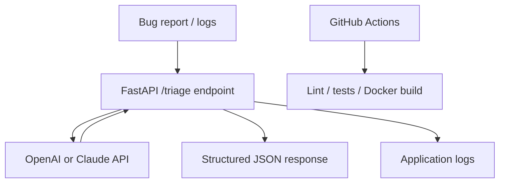
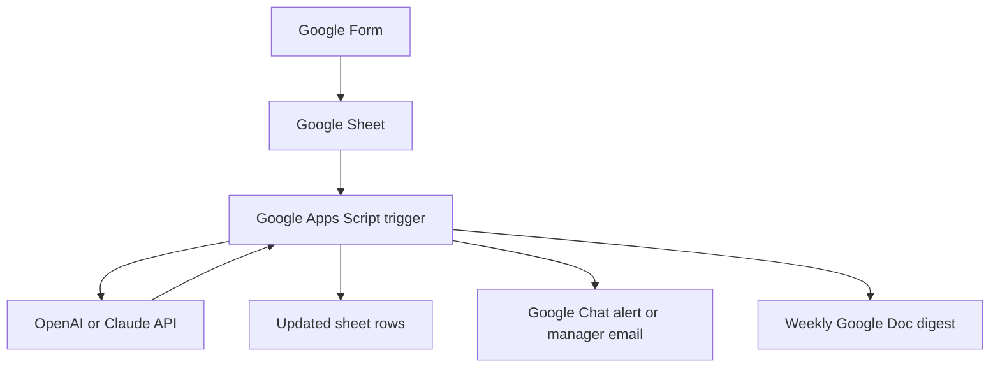

# AI Workflow Portfolio

This portfolio demonstrates how AI can be applied to realistic business workflows using a lightweight, practical toolset.

The implementation approach is intentionally simple and accessible:

- **local code** for core application development
- **GitHub** for source control, planning, and review
- **GitHub Actions** for CI and automation
- **Google Workspace** for forms, sheets, email, documents, chat, and lightweight workflow automation
- **OpenAI or Claude** as the external model provider

The aim is not to recreate a full enterprise platform, but to show the core skills involved in designing, building, testing, documenting, and evaluating AI-assisted workflows responsibly.

---

## Portfolio structure

This portfolio contains two main projects:

1. **Technical User Project**  
   AI Incident Triage & Release Notes API

2. **Non-Technical User Project**  
   AI Feedback Operations Hub

Each project has two provider-specific implementations:

- **OpenAI**
- **Claude**

This gives four solutions:

- `technical_openai/`
- `technical_claude/`
- `non_technical_openai/`
- `non_technical_claude/`

> Recommended build order:
>
> 1. `non_technical_openai/`
> 2. `technical_openai/`
> 3. `non_technical_claude/`
> 4. `technical_claude/`

---

## Why this portfolio is useful

Modern teams increasingly use AI to support workflows such as:

- bug and incident triage
- support ticket classification
- release note drafting
- survey and feedback analysis
- internal reporting
- email drafting
- escalation routing

In larger organisations, these workflows often sit inside wider ecosystems using tools such as:

- Jira
- ServiceNow
- PagerDuty
- Sentry
- Zendesk
- Salesforce
- Slack or Microsoft Teams
- workflow automation suites
- observability and governance tooling
- internal platforms and APIs

This demo intentionally uses a smaller and more manageable stack so the underlying workflow design and delivery skills stay visible.

---

## What this portfolio demonstrates

Across the repos, the portfolio demonstrates:

- translating business needs into technical requirements
- designing workflow-oriented systems
- building AI-powered services with structured outputs
- integrating OpenAI and Claude independently
- writing and refining prompts
- validating model outputs against schemas
- adding tests and evaluation datasets
- using AI-assisted code review with human oversight
- setting up CI workflows in GitHub Actions
- documenting runbooks, SOPs, and planning artefacts
- using Google Workspace as a practical automation layer
- comparing provider behaviour across quality, latency, and workflow fit

---

## Business-safe defaults

Use these defaults throughout:

- **Do not send secrets, customer PII, or production credentials** to any model.
- Use **sample or sanitised data only**.
- Keep **human approval** before anything customer-facing is sent.
- Treat AI outputs as **draft recommendations**, not autonomous actions.
- Store keys in:
  - `.env` for Python repos
  - **Script Properties** for Google Apps Script
  - **GitHub Secrets** for GitHub Actions

---

# Monorepo layout

Create this structure at the root of your portfolio repository:

```text
ai-workflow-portfolio/
  README.md
  technical_openai/
    app/
      __init__.py
      main.py
      prompt.py
      provider.py
      schemas.py
    data/
      eval_cases.jsonl
    docs/
      stakeholder_notes.md
      runbook.md
    scripts/
      evaluate.py
      generate_architecture.py
      generate_requirements.py
      review_diff.py
    tests/
      test_api.py
    .github/
      workflows/
        ci.yml
        pr-review.yml
    .env.example
    .gitignore
    Dockerfile
    requirements.txt

  technical_claude/
    app/
      __init__.py
      main.py
      prompt.py
      provider.py
      schemas.py
    data/
      eval_cases.jsonl
    docs/
      stakeholder_notes.md
      runbook.md
    scripts/
      evaluate.py
      generate_architecture.py
      generate_requirements.py
      review_diff.py
    tests/
      test_api.py
    .github/
      workflows/
        ci.yml
        pr-review.yml
    .env.example
    .gitignore
    Dockerfile
    requirements.txt

  non_technical_openai/
    docs/
      runbook.md
      test_plan.md
      workflow_charter.md
    evaluation/
      sample_feedback.csv
    .github/
      workflows/
        deploy-apps-script.yml
    .gitignore
    Code.gs
    appsscript.json

  non_technical_claude/
    docs/
      runbook.md
      test_plan.md
      workflow_charter.md
    evaluation/
      sample_feedback.csv
    .github/
      workflows/
        deploy-apps-script.yml
    .gitignore
    Code.gs
    appsscript.json
```

---

## Optional folder creation commands

### macOS / Linux

```bash
mkdir -p technical_openai/{app,data,docs,scripts,tests,.github/workflows}
mkdir -p technical_claude/{app,data,docs,scripts,tests,.github/workflows}
mkdir -p non_technical_openai/{docs,evaluation,.github/workflows}
mkdir -p non_technical_claude/{docs,evaluation,.github/workflows}
```

### Windows PowerShell

```powershell
mkdir technical_openai
mkdir technical_openai\app, technical_openai\data, technical_openai\docs, technical_openai\scripts, technical_openai\tests, technical_openai\.github, technical_openai\.github\workflows

mkdir technical_claude
mkdir technical_claude\app, technical_claude\data, technical_claude\docs, technical_claude\scripts, technical_claude\tests, technical_claude\.github, technical_claude\.github\workflows

mkdir non_technical_openai
mkdir non_technical_openai\docs, non_technical_openai\evaluation, non_technical_openai\.github, non_technical_openai\.github\workflows

mkdir non_technical_claude
mkdir non_technical_claude\docs, non_technical_claude\evaluation, non_technical_claude\.github, non_technical_claude\.github\workflows
```

---

# Project 1 — Technical Users  
# AI Incident Triage & Release Notes API

## What it does

This API accepts:

- issue title
- description
- logs
- changed files
- service name

It returns structured JSON containing:

- severity
- probable component
- root cause hypothesis
- recommended fix
- test plan
- rollback plan
- release note
- confidence score

## SDLC coverage

This technical project demonstrates:

- Requirements & Planning
- Design & Architecture
- Implementation
- Testing & QA
- Code Review
- CI
- Local deployment with Docker
- Monitoring via `/health` and logs
- Documentation & Runbook
- Evaluation against labelled sample cases

---

## Technical project architecture



---

## Shared technical files  
These files are the same in both:

- `technical_openai/`
- `technical_claude/`

Create the following files in **both** folders.

---

## `technical_openai/.gitignore`  
## `technical_claude/.gitignore`

```gitignore
.venv/
__pycache__/
.pytest_cache/
.ruff_cache/
.env
.DS_Store
*.pyc
```

---

## `technical_openai/Dockerfile`  
## `technical_claude/Dockerfile`

```dockerfile
FROM python:3.11-slim

WORKDIR /app

COPY requirements.txt .
RUN pip install --no-cache-dir -r requirements.txt

COPY app app
COPY data data
COPY scripts scripts

EXPOSE 8000

CMD ["sh", "-c", "uvicorn app.main:app --host 0.0.0.0 --port ${PORT:-8000}"]
```

---

## `technical_openai/app/__init__.py`  
## `technical_claude/app/__init__.py`

```python
```

---

## `technical_openai/app/schemas.py`  
## `technical_claude/app/schemas.py`

```python
from typing import List, Literal
from pydantic import BaseModel, Field

Severity = Literal["low", "medium", "high", "critical"]
Component = Literal["frontend", "backend", "database", "auth", "infra", "unknown"]


class TriageRequest(BaseModel):
    title: str = Field(..., min_length=3)
    description: str
    logs: str = ""
    changed_files: List[str] = Field(default_factory=list)
    service_name: str = "unknown"


class TriageResponse(BaseModel):
    severity: Severity
    probable_component: Component
    root_cause_hypothesis: str
    recommended_fix: str
    test_plan: List[str] = Field(default_factory=list)
    rollback_plan: str
    release_note: str
    confidence: float = Field(ge=0.0, le=1.0)
```

---

## `technical_openai/app/prompt.py`  
## `technical_claude/app/prompt.py`

```python
TRIAGE_SYSTEM_PROMPT = """
You are a senior engineering triage assistant.

Return ONLY valid JSON with this exact schema:
{
  "severity": "low|medium|high|critical",
  "probable_component": "frontend|backend|database|auth|infra|unknown",
  "root_cause_hypothesis": "string",
  "recommended_fix": "string",
  "test_plan": ["string", "string"],
  "rollback_plan": "string",
  "release_note": "string",
  "confidence": 0.0
}

Rules:
- Be specific but concise.
- If evidence is weak, say "insufficient evidence" explicitly.
- confidence must be between 0 and 1.
- release_note should be understandable by product and support stakeholders.
"""
```

---

## `technical_openai/app/main.py`  
## `technical_claude/app/main.py`

```python
import logging
import os

from dotenv import load_dotenv
from fastapi import FastAPI, HTTPException

from .provider import triage_issue
from .schemas import TriageRequest, TriageResponse

load_dotenv()

logging.basicConfig(
    level=os.getenv("LOG_LEVEL", "INFO"),
    format='{"time":"%(asctime)s","level":"%(levelname)s","message":"%(message)s"}',
)

logger = logging.getLogger(__name__)

app = FastAPI(title="AI Incident Triage API", version="0.1.0")


@app.get("/")
def root():
    return {
        "message": "AI Incident Triage API",
        "docs": "/docs",
        "health": "/health",
    }


@app.get("/health")
def health():
    return {"status": "ok"}


@app.post("/triage", response_model=TriageResponse)
def triage(req: TriageRequest):
    try:
        result = triage_issue(req)
        validated = TriageResponse(**result)

        logger.info(
            'triage_success title="%s" severity="%s" component="%s"',
            req.title,
            validated.severity,
            validated.probable_component,
        )
        return validated
    except Exception as err:
        logger.exception("triage_failed")
        raise HTTPException(status_code=500, detail=f"triage failed: {err}") from err
```

---

## `technical_openai/tests/test_api.py`  
## `technical_claude/tests/test_api.py`

```python
from fastapi.testclient import TestClient
from app.main import app

client = TestClient(app)


def test_root():
    response = client.get("/")
    assert response.status_code == 200
    assert response.json()["message"] == "AI Incident Triage API"


def test_health():
    response = client.get("/health")
    assert response.status_code == 200
    assert response.json() == {"status": "ok"}


def test_triage(monkeypatch):
    import app.main as main_module

    def fake_triage(_req):
        return {
            "severity": "high",
            "probable_component": "backend",
            "root_cause_hypothesis": "Null pointer after deploy",
            "recommended_fix": "Add null check and redeploy",
            "test_plan": ["Add unit test for missing payload", "Verify in staging"],
            "rollback_plan": "Roll back the most recent release",
            "release_note": "Improved API stability for failed requests.",
            "confidence": 0.84,
        }

    monkeypatch.setattr(main_module, "triage_issue", fake_triage)

    payload = {
        "title": "Users see 500 after deploy",
        "description": "Login endpoint returns 500 for some users",
        "logs": "AttributeError: 'NoneType' object has no attribute 'id'",
        "changed_files": ["api/login.py"],
        "service_name": "auth-service",
    }

    response = client.post("/triage", json=payload)
    assert response.status_code == 200
    assert response.json()["severity"] == "high"
    assert response.json()["probable_component"] == "backend"
```

---

## `technical_openai/data/eval_cases.jsonl`  
## `technical_claude/data/eval_cases.jsonl`

```json
{"input":{"title":"Login fails for SSO users","description":"All Okta sign-ins return 500 after today's deploy","logs":"KeyError: oidc_audience","changed_files":["auth.py","sso_config.py"],"service_name":"auth-service"},"expected":{"severity":"critical","probable_component":"auth"}}
{"input":{"title":"Dashboard loads slowly","description":"Average load time increased from 2s to 9s for some users","logs":"SELECT caused full table scan","changed_files":["analytics_query.sql"],"service_name":"reporting"},"expected":{"severity":"medium","probable_component":"database"}}
{"input":{"title":"Checkout button misaligned on mobile","description":"On iPhone SE the CTA is partially off screen","logs":"","changed_files":["checkout.css"],"service_name":"web-frontend"},"expected":{"severity":"low","probable_component":"frontend"}}
```

---

## `technical_openai/docs/stakeholder_notes.md`  
## `technical_claude/docs/stakeholder_notes.md`

```markdown
# Stakeholder Notes

- Support and QA submit 10 to 20 bug reports per week.
- Engineers spend too much time rewriting bug tickets into structured triage notes.
- We need severity, probable component, root cause hypothesis, recommended next step, test plan, rollback plan, and a short release note.
- Output must be valid JSON.
- The system must include `/health`, logs, tests, CI, and a runbook.
- Human review is required before any production action is taken.
- Use sample or sanitised data only.
```

---

## `technical_openai/docs/runbook.md`  
## `technical_claude/docs/runbook.md`

```markdown
# Runbook

## Purpose
This service provides AI-assisted incident triage for sample engineering issues.

## Health check
- `GET /health` should return `200` with `{"status": "ok"}`

## Common failures
1. `401` or `403`
   - API key missing or invalid
   - Check `.env` locally or GitHub Secrets in CI

2. `500` with JSON parsing error
   - Inspect raw provider output
   - Tighten the prompt
   - Add a regression case to `data/eval_cases.jsonl`

3. Latency spike
   - Retry later
   - Use a smaller model
   - Reduce prompt size

## Rollback
- Revert the last commit
- Re-run tests
- Rebuild the Docker image

## Operational notes
- Never send secrets or customer PII to the model
- Treat outputs as draft recommendations only
- Add new failure examples to the evaluation dataset
```

---

## `technical_openai/scripts/evaluate.py`  
## `technical_claude/scripts/evaluate.py`

```python
import json
import sys
import time

import requests

BASE_URL = sys.argv[1] if len(sys.argv) > 1 else "http://localhost:8000"

with open("data/eval_cases.jsonl", "r", encoding="utf-8") as f:
    cases = [json.loads(line) for line in f if line.strip()]

severity_hits = 0
component_hits = 0
latencies = []
failures = []

for case in cases:
    start = time.perf_counter()
    response = requests.post(f"{BASE_URL}/triage", json=case["input"], timeout=90)
    elapsed = time.perf_counter() - start
    latencies.append(elapsed)

    response.raise_for_status()
    predicted = response.json()
    expected = case["expected"]

    severity_ok = predicted["severity"] == expected["severity"]
    component_ok = predicted["probable_component"] == expected["probable_component"]

    severity_hits += int(severity_ok)
    component_hits += int(component_ok)

    if not (severity_ok and component_ok):
        failures.append(
            {
                "title": case["input"]["title"],
                "predicted": {
                    "severity": predicted["severity"],
                    "probable_component": predicted["probable_component"],
                },
                "expected": expected,
            }
        )

summary = {
    "cases": len(cases),
    "severity_accuracy": round(severity_hits / len(cases), 3) if cases else 0,
    "component_accuracy": round(component_hits / len(cases), 3) if cases else 0,
    "avg_latency_seconds": round(sum(latencies) / len(latencies), 3) if latencies else 0,
    "failures": failures,
}

print(json.dumps(summary, indent=2))
```

---

## `technical_openai/.github/workflows/ci.yml`  
## `technical_claude/.github/workflows/ci.yml`

```yaml
name: ci

on:
  pull_request:
  push:
    branches: [master]

jobs:
  test-build:
    runs-on: ubuntu-latest

    steps:
      - uses: actions/checkout@v4

      - uses: actions/setup-python@v5
        with:
          python-version: "3.11"

      - name: Install dependencies
        run: pip install -r requirements.txt

      - name: Lint
        run: ruff check .

      - name: Run tests
        run: pytest -q

      - name: Build Docker image
        run: docker build -t ai-incident-triage .

      - name: Smoke test container
        run: |
          docker run -d --name triage-smoke -p 8000:8000 ai-incident-triage
          sleep 5
          curl --fail http://localhost:8000/health
          docker stop triage-smoke
```

---

# Technical project — OpenAI version

Create these files in `technical_openai/`.

---

## `technical_openai/requirements.txt`

```text
fastapi
uvicorn[standard]
pydantic
openai
python-dotenv
pytest
httpx
ruff
requests
```

---

## `technical_openai/.env.example`

```text
OPENAI_API_KEY=your_key_here
OPENAI_MODEL=gpt-4o-mini
LOG_LEVEL=INFO
```

---

## `technical_openai/app/provider.py`

```python
import json
import os
from dotenv import load_dotenv
from openai import OpenAI

from .prompt import TRIAGE_SYSTEM_PROMPT
from .schemas import TriageRequest

load_dotenv()


def triage_issue(req: TriageRequest) -> dict:
    api_key = os.getenv("OPENAI_API_KEY")
    if not api_key:
        raise RuntimeError("OPENAI_API_KEY is not set")

    model = os.getenv("OPENAI_MODEL", "gpt-4o-mini")
    client = OpenAI(api_key=api_key)

    user_prompt = f"""
Issue title: {req.title}
Service: {req.service_name}

Description:
{req.description}

Logs:
{req.logs or "N/A"}

Changed files:
{", ".join(req.changed_files) if req.changed_files else "N/A"}
"""

    response = client.chat.completions.create(
        model=model,
        temperature=0.2,
        response_format={"type": "json_object"},
        messages=[
            {"role": "system", "content": TRIAGE_SYSTEM_PROMPT},
            {"role": "user", "content": user_prompt},
        ],
    )

    content = response.choices[0].message.content
    if not content:
        raise ValueError("Model returned empty content")

    return json.loads(content)
```

---

## `technical_openai/scripts/generate_requirements.py`

```python
import os
import sys

from dotenv import load_dotenv
from openai import OpenAI

load_dotenv()

if len(sys.argv) != 2:
    raise SystemExit("usage: python scripts/generate_requirements.py <stakeholder_notes.md>")

notes = open(sys.argv[1], "r", encoding="utf-8").read()

api_key = os.getenv("OPENAI_API_KEY")
if not api_key:
    raise RuntimeError("OPENAI_API_KEY is not set")

model = os.getenv("OPENAI_MODEL", "gpt-4o-mini")
client = OpenAI(api_key=api_key)

prompt = f"""
Convert these stakeholder notes into a concise PRD in Markdown.

Required sections:
- Problem statement
- Users
- Goals
- Non-goals
- Functional requirements
- Non-functional requirements
- Risks
- Acceptance criteria
- KPIs
- Rollout plan

Stakeholder notes:
{notes}
"""

response = client.chat.completions.create(
    model=model,
    temperature=0.2,
    messages=[
        {"role": "system", "content": "You are a product manager and delivery lead."},
        {"role": "user", "content": prompt},
    ],
)

print(response.choices[0].message.content)
```

---

## `technical_openai/scripts/generate_architecture.py`

```python
import os
import sys

from dotenv import load_dotenv
from openai import OpenAI

load_dotenv()

if len(sys.argv) != 2:
    raise SystemExit("usage: python scripts/generate_architecture.py <requirements.md>")

prd = open(sys.argv[1], "r", encoding="utf-8").read()

api_key = os.getenv("OPENAI_API_KEY")
if not api_key:
    raise RuntimeError("OPENAI_API_KEY is not set")

model = os.getenv("OPENAI_MODEL", "gpt-4o-mini")
client = OpenAI(api_key=api_key)

prompt = f"""
Based on this PRD, write a lightweight architecture document in Markdown.

Required sections:
- Overview
- Components
- API contract
- Data flow
- Failure modes and mitigations
- Test strategy
- Rollout and rollback
- Mermaid diagram

PRD:
{prd}
"""

response = client.chat.completions.create(
    model=model,
    temperature=0.2,
    messages=[
        {"role": "system", "content": "You are a staff engineer writing an architecture document."},
        {"role": "user", "content": prompt},
    ],
)

print(response.choices[0].message.content)
```

---

## `technical_openai/scripts/review_diff.py`

```python
import os
import sys

from dotenv import load_dotenv
from openai import OpenAI

load_dotenv()

if len(sys.argv) != 2:
    raise SystemExit("usage: python scripts/review_diff.py <diff_file>")

diff = open(sys.argv[1], "r", encoding="utf-8").read()[:120000]

api_key = os.getenv("OPENAI_API_KEY")
if not api_key:
    raise RuntimeError("OPENAI_API_KEY is not set")

model = os.getenv("OPENAI_MODEL", "gpt-4o-mini")
client = OpenAI(api_key=api_key)

prompt = f"""
Review this git diff like a senior software engineer.

Focus on:
- correctness
- breaking changes
- security
- missing tests
- readability
- rollback risk

Return Markdown with sections:
- Summary
- Blocking Issues
- Suggestions
- Missing Tests

Diff:
{diff}
"""

response = client.chat.completions.create(
    model=model,
    temperature=0.1,
    messages=[
        {"role": "system", "content": "You are a strict but practical code reviewer."},
        {"role": "user", "content": prompt},
    ],
)

print(response.choices[0].message.content)
```

---

## `technical_openai/.github/workflows/pr-review.yml`

```yaml
name: ai-pr-review

on:
  pull_request:
    types: [opened, synchronize, reopened]

permissions:
  contents: read
  pull-requests: write

jobs:
  review:
    runs-on: ubuntu-latest

    steps:
      - name: Skip when API key is not configured
        if: ${{ secrets.OPENAI_API_KEY == '' }}
        run: echo "OPENAI_API_KEY not set; skipping AI review."

      - uses: actions/checkout@v4
        if: ${{ secrets.OPENAI_API_KEY != '' }}
        with:
          fetch-depth: 0

      - uses: actions/setup-python@v5
        if: ${{ secrets.OPENAI_API_KEY != '' }}
        with:
          python-version: "3.11"

      - name: Install dependencies
        if: ${{ secrets.OPENAI_API_KEY != '' }}
        run: pip install -r requirements.txt

      - name: Build diff
        if: ${{ secrets.OPENAI_API_KEY != '' }}
        run: |
          git fetch origin ${{ github.base_ref }} --depth=1
          git diff origin/${{ github.base_ref }}...HEAD > pr.diff

      - name: Generate AI review
        if: ${{ secrets.OPENAI_API_KEY != '' }}
        run: python scripts/review_diff.py pr.diff > review.md
        env:
          OPENAI_API_KEY: ${{ secrets.OPENAI_API_KEY }}
          OPENAI_MODEL: gpt-4o-mini

      - name: Post sticky PR comment
        if: ${{ secrets.OPENAI_API_KEY != '' }}
        uses: marocchino/sticky-pull-request-comment@v2
        with:
          path: review.md
```

---

## How to run `technical_openai/`

### Local setup

```bash
cd technical_openai
python -m venv .venv
source .venv/bin/activate   # Windows: .venv\Scripts\activate
pip install -r requirements.txt
cp .env.example .env
```

Edit `.env` and add your real `OPENAI_API_KEY`.

### Run locally

```bash
uvicorn app.main:app --env-file .env --reload
```

Open:

- API docs: http://localhost:8000/docs
- Health check: http://localhost:8000/health

### Test the API

```bash
curl -X POST http://localhost:8000/triage \
  -H "Content-Type: application/json" \
  -d '{
    "title": "SSO users get 500 after deploy",
    "description": "After the latest auth release, all Okta users fail login",
    "logs": "KeyError: oidc_audience",
    "changed_files": ["auth.py", "sso_config.py"],
    "service_name": "auth-service"
  }'
```

### Generate planning documents

```bash
python scripts/generate_requirements.py docs/stakeholder_notes.md > docs/requirements.md
python scripts/generate_architecture.py docs/requirements.md > docs/architecture.md
```

### Run tests and evaluation

```bash
pytest -q
python scripts/evaluate.py http://localhost:8000
```

### Run with Docker

```bash
docker build -t technical-openai .
docker run --rm -p 8000:8000 --env-file .env technical-openai
```

---

# Technical project — Claude version

Create these files in `technical_claude/`.

---

## `technical_claude/requirements.txt`

```text
fastapi
uvicorn[standard]
pydantic
anthropic
python-dotenv
pytest
httpx
ruff
requests
```

---

## `technical_claude/.env.example`

```text
ANTHROPIC_API_KEY=your_key_here
ANTHROPIC_MODEL=claude-3-5-sonnet-20240620
LOG_LEVEL=INFO
```

---

## `technical_claude/app/provider.py`

```python
import json
import os
import re

from anthropic import Anthropic
from dotenv import load_dotenv

from .prompt import TRIAGE_SYSTEM_PROMPT
from .schemas import TriageRequest

load_dotenv()


def extract_json(text: str) -> dict:
    match = re.search(r"\{.*\}", text, re.S)
    if not match:
        raise ValueError(f"No JSON found in model output: {text}")
    return json.loads(match.group(0))


def triage_issue(req: TriageRequest) -> dict:
    api_key = os.getenv("ANTHROPIC_API_KEY")
    if not api_key:
        raise RuntimeError("ANTHROPIC_API_KEY is not set")

    model = os.getenv("ANTHROPIC_MODEL", "claude-3-5-sonnet-20240620")
    client = Anthropic(api_key=api_key)

    user_prompt = f"""
Analyse this issue and return JSON only.

Issue title: {req.title}
Service: {req.service_name}

Description:
{req.description}

Logs:
{req.logs or "N/A"}

Changed files:
{", ".join(req.changed_files) if req.changed_files else "N/A"}
"""

    response = client.messages.create(
        model=model,
        max_tokens=900,
        temperature=0.2,
        system=TRIAGE_SYSTEM_PROMPT + "\nReturn JSON only.",
        messages=[{"role": "user", "content": user_prompt}],
    )

    text = "".join(block.text for block in response.content if getattr(block, "type", "") == "text")
    return extract_json(text)
```

---

## `technical_claude/scripts/generate_requirements.py`

```python
import os
import sys

from anthropic import Anthropic
from dotenv import load_dotenv

load_dotenv()

if len(sys.argv) != 2:
    raise SystemExit("usage: python scripts/generate_requirements.py <stakeholder_notes.md>")

notes = open(sys.argv[1], "r", encoding="utf-8").read()

api_key = os.getenv("ANTHROPIC_API_KEY")
if not api_key:
    raise RuntimeError("ANTHROPIC_API_KEY is not set")

model = os.getenv("ANTHROPIC_MODEL", "claude-3-5-sonnet-20240620")
client = Anthropic(api_key=api_key)

prompt = f"""
Convert these stakeholder notes into a concise PRD in Markdown.

Required sections:
- Problem statement
- Users
- Goals
- Non-goals
- Functional requirements
- Non-functional requirements
- Risks
- Acceptance criteria
- KPIs
- Rollout plan

Stakeholder notes:
{notes}
"""

response = client.messages.create(
    model=model,
    max_tokens=1500,
    temperature=0.2,
    system="You are a product manager and delivery lead.",
    messages=[{"role": "user", "content": prompt}],
)

print("".join(block.text for block in response.content if getattr(block, "type", "") == "text"))
```

---

## `technical_claude/scripts/generate_architecture.py`

```python
import os
import sys

from anthropic import Anthropic
from dotenv import load_dotenv

load_dotenv()

if len(sys.argv) != 2:
    raise SystemExit("usage: python scripts/generate_architecture.py <requirements.md>")

prd = open(sys.argv[1], "r", encoding="utf-8").read()

api_key = os.getenv("ANTHROPIC_API_KEY")
if not api_key:
    raise RuntimeError("ANTHROPIC_API_KEY is not set")

model = os.getenv("ANTHROPIC_MODEL", "claude-3-5-sonnet-20240620")
client = Anthropic(api_key=api_key)

prompt = f"""
Based on this PRD, write a lightweight architecture document in Markdown.

Required sections:
- Overview
- Components
- API contract
- Data flow
- Failure modes and mitigations
- Test strategy
- Rollout and rollback
- Mermaid diagram

PRD:
{prd}
"""

response = client.messages.create(
    model=model,
    max_tokens=1800,
    temperature=0.2,
    system="You are a staff engineer writing an architecture document.",
    messages=[{"role": "user", "content": prompt}],
)

print("".join(block.text for block in response.content if getattr(block, "type", "") == "text"))
```

---

## `technical_claude/scripts/review_diff.py`

```python
import os
import sys

from anthropic import Anthropic
from dotenv import load_dotenv

load_dotenv()

if len(sys.argv) != 2:
    raise SystemExit("usage: python scripts/review_diff.py <diff_file>")

diff = open(sys.argv[1], "r", encoding="utf-8").read()[:120000]

api_key = os.getenv("ANTHROPIC_API_KEY")
if not api_key:
    raise RuntimeError("ANTHROPIC_API_KEY is not set")

model = os.getenv("ANTHROPIC_MODEL", "claude-3-5-sonnet-20240620")
client = Anthropic(api_key=api_key)

prompt = f"""
Review this git diff like a senior software engineer.

Focus on:
- correctness
- breaking changes
- security
- missing tests
- readability
- rollback risk

Return Markdown with sections:
- Summary
- Blocking Issues
- Suggestions
- Missing Tests

Diff:
{diff}
"""

response = client.messages.create(
    model=model,
    max_tokens=1600,
    temperature=0.1,
    system="You are a strict but practical code reviewer.",
    messages=[{"role": "user", "content": prompt}],
)

print("".join(block.text for block in response.content if getattr(block, "type", "") == "text"))
```

---

## `technical_claude/.github/workflows/pr-review.yml`

```yaml
name: ai-pr-review

on:
  pull_request:
    types: [opened, synchronize, reopened]

permissions:
  contents: read
  pull-requests: write

jobs:
  review:
    runs-on: ubuntu-latest

    steps:
      - name: Skip when API key is not configured
        if: ${{ secrets.ANTHROPIC_API_KEY == '' }}
        run: echo "ANTHROPIC_API_KEY not set; skipping AI review."

      - uses: actions/checkout@v4
        if: ${{ secrets.ANTHROPIC_API_KEY != '' }}
        with:
          fetch-depth: 0

      - uses: actions/setup-python@v5
        if: ${{ secrets.ANTHROPIC_API_KEY != '' }}
        with:
          python-version: "3.11"

      - name: Install dependencies
        if: ${{ secrets.ANTHROPIC_API_KEY != '' }}
        run: pip install -r requirements.txt

      - name: Build diff
        if: ${{ secrets.ANTHROPIC_API_KEY != '' }}
        run: |
          git fetch origin ${{ github.base_ref }} --depth=1
          git diff origin/${{ github.base_ref }}...HEAD > pr.diff

      - name: Generate AI review
        if: ${{ secrets.ANTHROPIC_API_KEY != '' }}
        run: python scripts/review_diff.py pr.diff > review.md
        env:
          ANTHROPIC_API_KEY: ${{ secrets.ANTHROPIC_API_KEY }}
          ANTHROPIC_MODEL: claude-3-5-sonnet-20240620

      - name: Post sticky PR comment
        if: ${{ secrets.ANTHROPIC_API_KEY != '' }}
        uses: marocchino/sticky-pull-request-comment@v2
        with:
          path: review.md
```

---

## How to run `technical_claude/`

### Local setup

```bash
cd technical_claude
python -m venv .venv
source .venv/bin/activate   # Windows: .venv\Scripts\activate
pip install -r requirements.txt
cp .env.example .env
```

Edit `.env` and add your real `ANTHROPIC_API_KEY`.

### Run locally

```bash
uvicorn app.main:app --env-file .env --reload
```

Open:

- API docs: http://localhost:8000/docs
- Health check: http://localhost:8000/health

### Test the API

```bash
curl -X POST http://localhost:8000/triage \
  -H "Content-Type: application/json" \
  -d '{
    "title": "SSO users get 500 after deploy",
    "description": "After the latest auth release, all Okta users fail login",
    "logs": "KeyError: oidc_audience",
    "changed_files": ["auth.py", "sso_config.py"],
    "service_name": "auth-service"
  }'
```

### Generate planning documents

```bash
python scripts/generate_requirements.py docs/stakeholder_notes.md > docs/requirements.md
python scripts/generate_architecture.py docs/requirements.md > docs/architecture.md
```

### Run tests and evaluation

```bash
pytest -q
python scripts/evaluate.py http://localhost:8000
```

### Run with Docker

```bash
docker build -t technical-claude .
docker run --rm -p 8000:8000 --env-file .env technical-claude
```

---

# Technical project evaluation

Useful metrics to track after each change:

- severity accuracy
- component accuracy
- schema-valid response rate
- average latency
- parsing reliability
- release note usefulness
- quality of AI-assisted code review comments

---

# Project 2 — Non-Technical Users  
# AI Feedback Operations Hub

## What it does

This workflow:

1. collects feedback from a Google Form or Google Sheet
2. classifies each entry by:
   - theme
   - sentiment
   - urgency
   - next action
   - owner suggestion
3. drafts a follow-up email
4. flags urgent items
5. creates a weekly Google Doc digest
6. emails the digest to a manager

## SDLC coverage

This non-technical project demonstrates:

- Requirements & Planning
- Workflow design
- Apps Script implementation
- Testing with sample submissions
- Review and approval checkpoints
- Optional GitHub-based deployment with `clasp`
- Monitoring through sheet status and email/chat alerts
- SOP and runbook documentation
- Evaluation using a Google Sheet

---

## Non-technical project architecture



---

## Recommended Google Sheet columns

Your form-linked sheet should begin with:

- **A** Timestamp
- **B** Customer
- **C** Channel
- **D** Feedback

The script will add:

- **E** Theme
- **F** Sentiment
- **G** Urgency
- **H** Next Action
- **I** Owner Suggestion
- **J** Follow-up Draft
- **K** Status

Optional additional columns:

- **L** Reviewer
- **M** Approved?
- **N** Notes

---

## Shared non-technical files  
These files are the same in both:

- `non_technical_openai/`
- `non_technical_claude/`

Create the following files in **both** folders.

---

## `non_technical_openai/.gitignore`  
## `non_technical_claude/.gitignore`

```gitignore
.clasp.json
node_modules/
.DS_Store
```

---

## `non_technical_openai/appsscript.json`  
## `non_technical_claude/appsscript.json`

```json
{
  "timeZone": "Etc/UTC",
  "exceptionLogging": "STACKDRIVER",
  "runtimeVersion": "V8",
  "oauthScopes": [
    "https://www.googleapis.com/auth/spreadsheets",
    "https://www.googleapis.com/auth/documents",
    "https://www.googleapis.com/auth/script.external_request",
    "https://www.googleapis.com/auth/script.scriptapp",
    "https://www.googleapis.com/auth/script.send_mail"
  ]
}
```

---

## `non_technical_openai/docs/workflow_charter.md`  
## `non_technical_claude/docs/workflow_charter.md`

```markdown
# Workflow Charter

## Objective
Classify incoming feedback from a Google Form, route urgent items for attention, and produce weekly management summaries.

## Stakeholders
- Manager or operations lead
- Product or support reviewer
- Internal users submitting feedback

## Inputs
- Customer
- Channel
- Feedback

## Outputs
- Theme
- Sentiment
- Urgency
- Next Action
- Owner Suggestion
- Follow-up Draft
- Weekly summary

## Approval model
- AI drafts are advisory
- Human review is required before any customer-facing response is sent

## Risks
- Incorrect urgency classification
- Over-confident drafting
- Inconsistent themes on ambiguous input

## Mitigations
- Use sanitised data only
- Review urgent items manually
- Track output quality in an evaluation sheet

## Success measures
- Reduced manual handling time
- Acceptable theme and urgency accuracy
- Positive reviewer feedback on weekly summaries
```

---

## `non_technical_openai/docs/runbook.md`  
## `non_technical_claude/docs/runbook.md`

```markdown
# Runbook

## Purpose
This Apps Script workflow processes Google Form responses and classifies them with AI.

## Setup checks
- Form is linked to the correct sheet
- Sheet name is `Form Responses 1`
- Script Properties are configured
- Triggers have been created with the correct setup function

## Common failures
1. Missing Script Property
   - Add the missing property in Apps Script settings

2. HTTP error from provider
   - Check API key
   - Check model name
   - Review provider quota or billing

3. JSON parsing error
   - Inspect raw response
   - Tighten the prompt
   - Re-run on a sample row

## Manual recovery
- Mark failed rows as `MANUAL_REVIEW`
- Review the feedback manually
- Add notes in the sheet if needed

## Weekly digest
- Can run automatically every Monday
- Can also be run manually from the Apps Script editor

## Safety
- Do not auto-send customer responses
- Use outputs as drafts only
- Do not send secrets or production-sensitive content to the model
```

---

## `non_technical_openai/docs/test_plan.md`  
## `non_technical_claude/docs/test_plan.md`

```markdown
# Test Plan

## Test records
Submit at least:
- one positive item
- one neutral or ambiguous item
- one urgent negative item

## Expected checks
- output columns E to K are populated
- status becomes `PROCESSED`
- urgent items trigger manager email
- urgent items optionally trigger Google Chat
- weekly digest creates a Google Doc
- weekly digest sends an email to the manager

## Failure handling
- simulated provider errors should set status to `MANUAL_REVIEW`
- manager should receive an error email
```

---

## `non_technical_openai/evaluation/sample_feedback.csv`  
## `non_technical_claude/evaluation/sample_feedback.csv`

```csv
Customer,Channel,Feedback
Acme Ltd,Email,"The onboarding guide was clear and helpful, thank you."
Northwind,Support call,"We are frustrated that reporting exports are failing intermittently."
Globex,Form,"The mobile layout is confusing on smaller screens."
Innotech,Email,"Please contact us urgently. Billing appears incorrect for multiple users."
```

---

## `non_technical_openai/.github/workflows/deploy-apps-script.yml`  
## `non_technical_claude/.github/workflows/deploy-apps-script.yml`

```yaml
name: deploy-apps-script

on:
  workflow_dispatch:
  push:
    branches: [master]

jobs:
  deploy:
    if: ${{ secrets.CLASPRC_JSON != '' && secrets.CLASP_JSON != '' }}
    runs-on: ubuntu-latest

    steps:
      - uses: actions/checkout@v4

      - uses: actions/setup-node@v4
        with:
          node-version: "20"

      - name: Install clasp
        run: npm install -g @google/clasp

      - name: Restore clasp credentials
        run: printf '%s' '${{ secrets.CLASPRC_JSON }}' > ~/.clasprc.json

      - name: Restore clasp project config
        run: printf '%s' '${{ secrets.CLASP_JSON }}' > .clasp.json

      - name: Push Apps Script project
        run: clasp push --force
```

---

# Non-technical project — OpenAI version

Create this file in `non_technical_openai/`.

---

## `non_technical_openai/Code.gs`

```javascript
const INPUT_SHEET = 'Form Responses 1';

function getProp_(name) {
  const value = PropertiesService.getScriptProperties().getProperty(name);
  if (!value) throw new Error('Missing Script Property: ' + name);
  return value;
}

function normaliseKey_(text) {
  return String(text).trim().toLowerCase().replace(/[^a-z0-9]+/g, '_');
}

function extractJson_(text) {
  const start = text.indexOf('{');
  const end = text.lastIndexOf('}');
  if (start === -1 || end === -1) {
    throw new Error('No JSON found in model output: ' + text);
  }
  return JSON.parse(text.substring(start, end + 1));
}

function ensureHttpOk_(response) {
  const code = response.getResponseCode();
  if (code >= 300) {
    throw new Error('HTTP ' + code + ': ' + response.getContentText());
  }
}

function getInputSheet_() {
  const sheet = SpreadsheetApp.getActiveSpreadsheet().getSheetByName(INPUT_SHEET);
  if (!sheet) {
    throw new Error('Sheet not found: ' + INPUT_SHEET);
  }
  return sheet;
}

function prepareOutputColumns_() {
  const sheet = getInputSheet_();
  const headers = [
    'Theme',
    'Sentiment',
    'Urgency',
    'Next Action',
    'Owner Suggestion',
    'Follow-up Draft',
    'Status'
  ];
  sheet.getRange(1, 5, 1, headers.length).setValues([headers]);
}

function rowToObject_(headers, values) {
  const obj = {};
  headers.forEach(function (header, i) {
    obj[normaliseKey_(header)] = values[i];
  });
  return obj;
}

function writeAnalysis_(sheet, row, result) {
  sheet.getRange(row, 5, 1, 6).setValues([[
    result.theme || '',
    result.sentiment || '',
    result.urgency || '',
    result.next_action || '',
    result.owner_suggestion || '',
    result.follow_up_email || ''
  ]]);
  sheet.getRange(row, 11).setValue('PROCESSED');
}

function postGoogleChatAlert_(message) {
  const webhook = PropertiesService.getScriptProperties().getProperty('GOOGLE_CHAT_WEBHOOK_URL');
  if (!webhook) return;

  UrlFetchApp.fetch(webhook, {
    method: 'post',
    contentType: 'application/json',
    payload: JSON.stringify({ text: message }),
    muteHttpExceptions: true
  });
}

function emailManager_(subject, body) {
  const email = PropertiesService.getScriptProperties().getProperty('MANAGER_EMAIL');
  if (!email) return;
  MailApp.sendEmail(email, subject, body);
}

function deleteAllTriggers_() {
  ScriptApp.getProjectTriggers().forEach(function (trigger) {
    ScriptApp.deleteTrigger(trigger);
  });
}

function processFeedbackRow_(sheet, row, analyserFn) {
  if (row <= 1) return;

  const headers = sheet.getRange(1, 1, 1, 4).getValues()[0];
  const values = sheet.getRange(row, 1, 1, 4).getValues()[0];
  const record = rowToObject_(headers, values);

  const result = analyserFn(record);
  writeAnalysis_(sheet, row, result);

  const urgency = String(result.urgency || '').toLowerCase();
  if (urgency === 'high' || urgency === 'critical') {
    postGoogleChatAlert_(
      'Urgent feedback detected\n' +
      'Customer: ' + (record.customer || 'Unknown') + '\n' +
      'Channel: ' + (record.channel || 'Unknown') + '\n' +
      'Feedback: ' + (record.feedback || '')
    );

    emailManager_(
      'Urgent feedback detected',
      'Customer: ' + (record.customer || 'Unknown') + '\n' +
      'Channel: ' + (record.channel || 'Unknown') + '\n' +
      'Feedback: ' + (record.feedback || '') + '\n\n' +
      'Suggested next action: ' + (result.next_action || '')
    );
  }
}

function buildWeeklyRecords_() {
  const sheet = getInputSheet_();
  const rows = sheet.getDataRange().getValues();
  const headers = rows[0];
  const cutoff = Date.now() - 7 * 24 * 60 * 60 * 1000;

  return rows
    .slice(1)
    .filter(function (row) {
      return new Date(row[0]).getTime() >= cutoff;
    })
    .map(function (row) {
      return rowToObject_(headers, row);
    });
}

function writeWeeklyDoc_(title, summary) {
  const doc = DocumentApp.create(title);
  doc.getBody().appendParagraph(summary);
  doc.saveAndClose();
  return doc.getUrl();
}

function emailWeeklyDigest_(summary, docUrl) {
  const managerEmail = getProp_('MANAGER_EMAIL');
  const body = summary + '\n\nGoogle Doc: ' + docUrl;
  MailApp.sendEmail(managerEmail, 'Weekly Feedback Digest', body);
}

function onFormSubmitOpenAI(e) {
  const sheet = e.range.getSheet();
  const row = e.range.getRow();

  try {
    processFeedbackRow_(sheet, row, analyseWithOpenAI);
  } catch (err) {
    sheet.getRange(row, 11).setValue('MANUAL_REVIEW');
    Logger.log(err.stack || err);
    emailManager_('OpenAI Feedback Hub Error', String(err));
  }
}

function testOpenAIOnLastRow() {
  const sheet = getInputSheet_();
  processFeedbackRow_(sheet, sheet.getLastRow(), analyseWithOpenAI);
}

function setupTriggersOpenAI() {
  deleteAllTriggers_();
  prepareOutputColumns_();

  ScriptApp.newTrigger('onFormSubmitOpenAI')
    .forSpreadsheet(SpreadsheetApp.getActive())
    .onFormSubmit()
    .create();

  ScriptApp.newTrigger('weeklyDigestOpenAI')
    .timeBased()
    .onWeekDay(ScriptApp.WeekDay.MONDAY)
    .atHour(8)
    .create();
}

function analyseWithOpenAI(record) {
  const apiKey = getProp_('OPENAI_API_KEY');
  const model = PropertiesService.getScriptProperties().getProperty('OPENAI_MODEL') || 'gpt-4o-mini';

  const payload = {
    model: model,
    temperature: 0.2,
    response_format: { type: 'json_object' },
    messages: [
      {
        role: 'system',
        content: 'You are a customer operations analyst. Return JSON with keys: theme, sentiment, urgency, next_action, owner_suggestion, follow_up_email. sentiment must be one of positive, neutral, negative. urgency must be one of low, medium, high, critical.'
      },
      {
        role: 'user',
        content: JSON.stringify(record, null, 2)
      }
    ]
  };

  const response = UrlFetchApp.fetch('https://api.openai.com/v1/chat/completions', {
    method: 'post',
    contentType: 'application/json',
    headers: {
      Authorization: 'Bearer ' + apiKey
    },
    payload: JSON.stringify(payload),
    muteHttpExceptions: true
  });

  ensureHttpOk_(response);

  const data = JSON.parse(response.getContentText());
  return JSON.parse(data.choices[0].message.content);
}

function summariseWithOpenAI(records) {
  const apiKey = getProp_('OPENAI_API_KEY');
  const model = PropertiesService.getScriptProperties().getProperty('OPENAI_MODEL') || 'gpt-4o-mini';

  const payload = {
    model: model,
    temperature: 0.2,
    messages: [
      {
        role: 'system',
        content: 'You are a business operations analyst. Write a concise weekly digest with sections: Top Themes, Urgent Items, Recommended Actions, Risks, and 3 representative quotes. Keep it under 400 words.'
      },
      {
        role: 'user',
        content: JSON.stringify(records, null, 2)
      }
    ]
  };

  const response = UrlFetchApp.fetch('https://api.openai.com/v1/chat/completions', {
    method: 'post',
    contentType: 'application/json',
    headers: {
      Authorization: 'Bearer ' + apiKey
    },
    payload: JSON.stringify(payload),
    muteHttpExceptions: true
  });

  ensureHttpOk_(response);

  const data = JSON.parse(response.getContentText());
  return data.choices[0].message.content;
}

function weeklyDigestOpenAI() {
  const records = buildWeeklyRecords_();
  const summary = summariseWithOpenAI(records);
  const title = 'Weekly Feedback Digest - ' +
    Utilities.formatDate(new Date(), Session.getScriptTimeZone(), 'yyyy-MM-dd');
  const docUrl = writeWeeklyDoc_(title, summary);
  emailWeeklyDigest_(summary, docUrl);
}
```

---

## How to set up `non_technical_openai/`

### Step 1 — create the Google Form

Create a Google Form with fields:

- Customer
- Channel
- Feedback

Link it to a Google Sheet.

### Step 2 — open Apps Script

From the linked sheet:

- go to **Extensions → Apps Script**

### Step 3 — paste code

- replace the default script with the contents of `Code.gs`
- replace the manifest with `appsscript.json`

### Step 4 — set Script Properties

In **Project Settings → Script Properties**, add:

- `OPENAI_API_KEY`
- `OPENAI_MODEL` = `gpt-4o-mini` optional
- `MANAGER_EMAIL`
- `GOOGLE_CHAT_WEBHOOK_URL` optional

### Step 5 — run setup

Run this once:

```javascript
setupTriggersOpenAI()
```

Authorise the script when prompted.

### Step 6 — test

Submit sample form responses and confirm that:

- columns E to K populate
- urgent items trigger a manager email
- Google Chat alert works if configured
- weekly digest can run manually

### Manual test function

You can also run this in Apps Script after adding a sample row:

```javascript
testOpenAIOnLastRow()
```

---

# Non-technical project — Claude version

Create this file in `non_technical_claude/`.

---

## `non_technical_claude/Code.gs`

```javascript
const INPUT_SHEET = 'Form Responses 1';

function getProp_(name) {
  const value = PropertiesService.getScriptProperties().getProperty(name);
  if (!value) throw new Error('Missing Script Property: ' + name);
  return value;
}

function normaliseKey_(text) {
  return String(text).trim().toLowerCase().replace(/[^a-z0-9]+/g, '_');
}

function extractJson_(text) {
  const start = text.indexOf('{');
  const end = text.lastIndexOf('}');
  if (start === -1 || end === -1) {
    throw new Error('No JSON found in model output: ' + text);
  }
  return JSON.parse(text.substring(start, end + 1));
}

function ensureHttpOk_(response) {
  const code = response.getResponseCode();
  if (code >= 300) {
    throw new Error('HTTP ' + code + ': ' + response.getContentText());
  }
}

function getInputSheet_() {
  const sheet = SpreadsheetApp.getActiveSpreadsheet().getSheetByName(INPUT_SHEET);
  if (!sheet) {
    throw new Error('Sheet not found: ' + INPUT_SHEET);
  }
  return sheet;
}

function prepareOutputColumns_() {
  const sheet = getInputSheet_();
  const headers = [
    'Theme',
    'Sentiment',
    'Urgency',
    'Next Action',
    'Owner Suggestion',
    'Follow-up Draft',
    'Status'
  ];
  sheet.getRange(1, 5, 1, headers.length).setValues([headers]);
}

function rowToObject_(headers, values) {
  const obj = {};
  headers.forEach(function (header, i) {
    obj[normaliseKey_(header)] = values[i];
  });
  return obj;
}

function writeAnalysis_(sheet, row, result) {
  sheet.getRange(row, 5, 1, 6).setValues([[
    result.theme || '',
    result.sentiment || '',
    result.urgency || '',
    result.next_action || '',
    result.owner_suggestion || '',
    result.follow_up_email || ''
  ]]);
  sheet.getRange(row, 11).setValue('PROCESSED');
}

function postGoogleChatAlert_(message) {
  const webhook = PropertiesService.getScriptProperties().getProperty('GOOGLE_CHAT_WEBHOOK_URL');
  if (!webhook) return;

  UrlFetchApp.fetch(webhook, {
    method: 'post',
    contentType: 'application/json',
    payload: JSON.stringify({ text: message }),
    muteHttpExceptions: true
  });
}

function emailManager_(subject, body) {
  const email = PropertiesService.getScriptProperties().getProperty('MANAGER_EMAIL');
  if (!email) return;
  MailApp.sendEmail(email, subject, body);
}

function deleteAllTriggers_() {
  ScriptApp.getProjectTriggers().forEach(function (trigger) {
    ScriptApp.deleteTrigger(trigger);
  });
}

function processFeedbackRow_(sheet, row, analyserFn) {
  if (row <= 1) return;

  const headers = sheet.getRange(1, 1, 1, 4).getValues()[0];
  const values = sheet.getRange(row, 1, 1, 4).getValues()[0];
  const record = rowToObject_(headers, values);

  const result = analyserFn(record);
  writeAnalysis_(sheet, row, result);

  const urgency = String(result.urgency || '').toLowerCase();
  if (urgency === 'high' || urgency === 'critical') {
    postGoogleChatAlert_(
      'Urgent feedback detected\n' +
      'Customer: ' + (record.customer || 'Unknown') + '\n' +
      'Channel: ' + (record.channel || 'Unknown') + '\n' +
      'Feedback: ' + (record.feedback || '')
    );

    emailManager_(
      'Urgent feedback detected',
      'Customer: ' + (record.customer || 'Unknown') + '\n' +
      'Channel: ' + (record.channel || 'Unknown') + '\n' +
      'Feedback: ' + (record.feedback || '') + '\n\n' +
      'Suggested next action: ' + (result.next_action || '')
    );
  }
}

function buildWeeklyRecords_() {
  const sheet = getInputSheet_();
  const rows = sheet.getDataRange().getValues();
  const headers = rows[0];
  const cutoff = Date.now() - 7 * 24 * 60 * 60 * 1000;

  return rows
    .slice(1)
    .filter(function (row) {
      return new Date(row[0]).getTime() >= cutoff;
    })
    .map(function (row) {
      return rowToObject_(headers, row);
    });
}

function writeWeeklyDoc_(title, summary) {
  const doc = DocumentApp.create(title);
  doc.getBody().appendParagraph(summary);
  doc.saveAndClose();
  return doc.getUrl();
}

function emailWeeklyDigest_(summary, docUrl) {
  const managerEmail = getProp_('MANAGER_EMAIL');
  const body = summary + '\n\nGoogle Doc: ' + docUrl;
  MailApp.sendEmail(managerEmail, 'Weekly Feedback Digest', body);
}

function onFormSubmitClaude(e) {
  const sheet = e.range.getSheet();
  const row = e.range.getRow();

  try {
    processFeedbackRow_(sheet, row, analyseWithClaude);
  } catch (err) {
    sheet.getRange(row, 11).setValue('MANUAL_REVIEW');
    Logger.log(err.stack || err);
    emailManager_('Claude Feedback Hub Error', String(err));
  }
}

function testClaudeOnLastRow() {
  const sheet = getInputSheet_();
  processFeedbackRow_(sheet, sheet.getLastRow(), analyseWithClaude);
}

function setupTriggersClaude() {
  deleteAllTriggers_();
  prepareOutputColumns_();

  ScriptApp.newTrigger('onFormSubmitClaude')
    .forSpreadsheet(SpreadsheetApp.getActive())
    .onFormSubmit()
    .create();

  ScriptApp.newTrigger('weeklyDigestClaude')
    .timeBased()
    .onWeekDay(ScriptApp.WeekDay.MONDAY)
    .atHour(8)
    .create();
}

function analyseWithClaude(record) {
  const apiKey = getProp_('ANTHROPIC_API_KEY');
  const model = PropertiesService.getScriptProperties().getProperty('ANTHROPIC_MODEL') || 'claude-3-5-sonnet-20240620';

  const payload = {
    model: model,
    max_tokens: 800,
    temperature: 0.2,
    system: 'You are a customer operations analyst. Return JSON only with keys: theme, sentiment, urgency, next_action, owner_suggestion, follow_up_email. sentiment must be one of positive, neutral, negative. urgency must be one of low, medium, high, critical.',
    messages: [
      {
        role: 'user',
        content: JSON.stringify(record, null, 2)
      }
    ]
  };

  const response = UrlFetchApp.fetch('https://api.anthropic.com/v1/messages', {
    method: 'post',
    contentType: 'application/json',
    headers: {
      'x-api-key': apiKey,
      'anthropic-version': '2023-06-01'
    },
    payload: JSON.stringify(payload),
    muteHttpExceptions: true
  });

  ensureHttpOk_(response);

  const data = JSON.parse(response.getContentText());
  const text = data.content.map(function (block) {
    return block.text || '';
  }).join('');

  return extractJson_(text);
}

function summariseWithClaude(records) {
  const apiKey = getProp_('ANTHROPIC_API_KEY');
  const model = PropertiesService.getScriptProperties().getProperty('ANTHROPIC_MODEL') || 'claude-3-5-sonnet-20240620';

  const payload = {
    model: model,
    max_tokens: 1200,
    temperature: 0.2,
    system: 'You are a business operations analyst. Write a concise weekly digest with sections: Top Themes, Urgent Items, Recommended Actions, Risks, and 3 representative quotes. Keep it under 400 words.',
    messages: [
      {
        role: 'user',
        content: JSON.stringify(records, null, 2)
      }
    ]
  };

  const response = UrlFetchApp.fetch('https://api.anthropic.com/v1/messages', {
    method: 'post',
    contentType: 'application/json',
    headers: {
      'x-api-key': apiKey,
      'anthropic-version': '2023-06-01'
    },
    payload: JSON.stringify(payload),
    muteHttpExceptions: true
  });

  ensureHttpOk_(response);

  const data = JSON.parse(response.getContentText());
  return data.content.map(function (block) {
    return block.text || '';
  }).join('');
}

function weeklyDigestClaude() {
  const records = buildWeeklyRecords_();
  const summary = summariseWithClaude(records);
  const title = 'Weekly Feedback Digest - ' +
    Utilities.formatDate(new Date(), Session.getScriptTimeZone(), 'yyyy-MM-dd');
  const docUrl = writeWeeklyDoc_(title, summary);
  emailWeeklyDigest_(summary, docUrl);
}
```

---

## How to set up `non_technical_claude/`

### Step 1 — create the Google Form

Create a Google Form with fields:

- Customer
- Channel
- Feedback

Link it to a Google Sheet.

### Step 2 — open Apps Script

From the linked sheet:

- go to **Extensions → Apps Script**

### Step 3 — paste code

- replace the default script with the contents of `Code.gs`
- replace the manifest with `appsscript.json`

### Step 4 — set Script Properties

In **Project Settings → Script Properties**, add:

- `ANTHROPIC_API_KEY`
- `ANTHROPIC_MODEL` = `claude-3-5-sonnet-20240620` optional
- `MANAGER_EMAIL`
- `GOOGLE_CHAT_WEBHOOK_URL` optional

### Step 5 — run setup

Run this once:

```javascript
setupTriggersClaude()
```

Authorise the script when prompted.

### Step 6 — test

Submit sample form responses and confirm that:

- columns E to K populate
- urgent items trigger a manager email
- Google Chat alert works if configured
- weekly digest can run manually

### Manual test function

You can also run this in Apps Script after adding a sample row:

```javascript
testClaudeOnLastRow()
```

---

# Optional GitHub deployment for Apps Script with `clasp`

This applies to both:

- `non_technical_openai/`
- `non_technical_claude/`

## Local setup

```bash
npm install -g @google/clasp
clasp login
clasp clone YOUR_SCRIPT_ID
```

Then copy:

- `Code.gs`
- `appsscript.json`

from the appropriate folder into the cloned Apps Script project directory.

## Push manually

```bash
clasp push
```

## GitHub Secrets for automated deployment

If you want the GitHub Actions deploy workflow to work, add:

- `CLASPRC_JSON`
- `CLASP_JSON`

---

# Non-technical project evaluation

Create a second Google Sheet tab called `Evaluation` with columns:

- A: Record ID
- B: Human Theme
- C: AI Theme
- D: Theme Match
- E: Human Urgency
- F: AI Urgency
- G: Urgency Match
- H: Draft Accepted With Minor Edits?
- I: Minutes Saved

Useful formulas:

## Theme accuracy

```excel
=COUNTIF(D2:D, TRUE) / MAX(1, COUNTIF(B2:B, "<>"))
```

## Urgency accuracy

```excel
=COUNTIF(G2:G, TRUE) / MAX(1, COUNTIF(E2:E, "<>"))
```

## Draft approval rate

```excel
=COUNTIF(H2:H, TRUE) / MAX(1, COUNTA(H2:H))
```

## Average time saved

```excel
=AVERAGE(I2:I)
```

---

# Provider comparison scorecard

Use this after you build more than one implementation.

| Metric | Technical OpenAI | Technical Claude | Non-technical OpenAI | Non-technical Claude |
|---|---:|---:|---:|---:|
| Ease of setup |  |  |  |  |
| Output quality |  |  |  |  |
| JSON reliability |  |  |  |  |
| Latency |  |  |  |  |
| Cost |  |  |  |  |
| Human edit rate |  |  |  |  |
| Best use cases |  |  |  |  |

This is useful in interviews because it shows that you can evaluate tools pragmatically rather than simply use them.

---

# GitHub secrets and local configuration

## `technical_openai/`

### Local `.env`
- `OPENAI_API_KEY`
- `OPENAI_MODEL`
- `LOG_LEVEL`

### GitHub Secrets
- `OPENAI_API_KEY`

---

## `technical_claude/`

### Local `.env`
- `ANTHROPIC_API_KEY`
- `ANTHROPIC_MODEL`
- `LOG_LEVEL`

### GitHub Secrets
- `ANTHROPIC_API_KEY`

---

## `non_technical_openai/`

### Apps Script Script Properties
- `OPENAI_API_KEY`
- `OPENAI_MODEL`
- `MANAGER_EMAIL`
- `GOOGLE_CHAT_WEBHOOK_URL` optional

### Optional GitHub Secrets for `clasp`
- `CLASPRC_JSON`
- `CLASP_JSON`

---

## `non_technical_claude/`

### Apps Script Script Properties
- `ANTHROPIC_API_KEY`
- `ANTHROPIC_MODEL`
- `MANAGER_EMAIL`
- `GOOGLE_CHAT_WEBHOOK_URL` optional

### Optional GitHub Secrets for `clasp`
- `CLASPRC_JSON`
- `CLASP_JSON`

---

# How to run everything

## Fastest path

### 1. Build `non_technical_openai/`
- quickest end-to-end workflow
- easiest to demo to non-technical audiences

### 2. Build `technical_openai/`
- adds engineering depth and API delivery skills

### 3. Build `non_technical_claude/`
- compare provider behaviour in a workflow automation context

### 4. Build `technical_claude/`
- compare provider behaviour in a backend engineering context