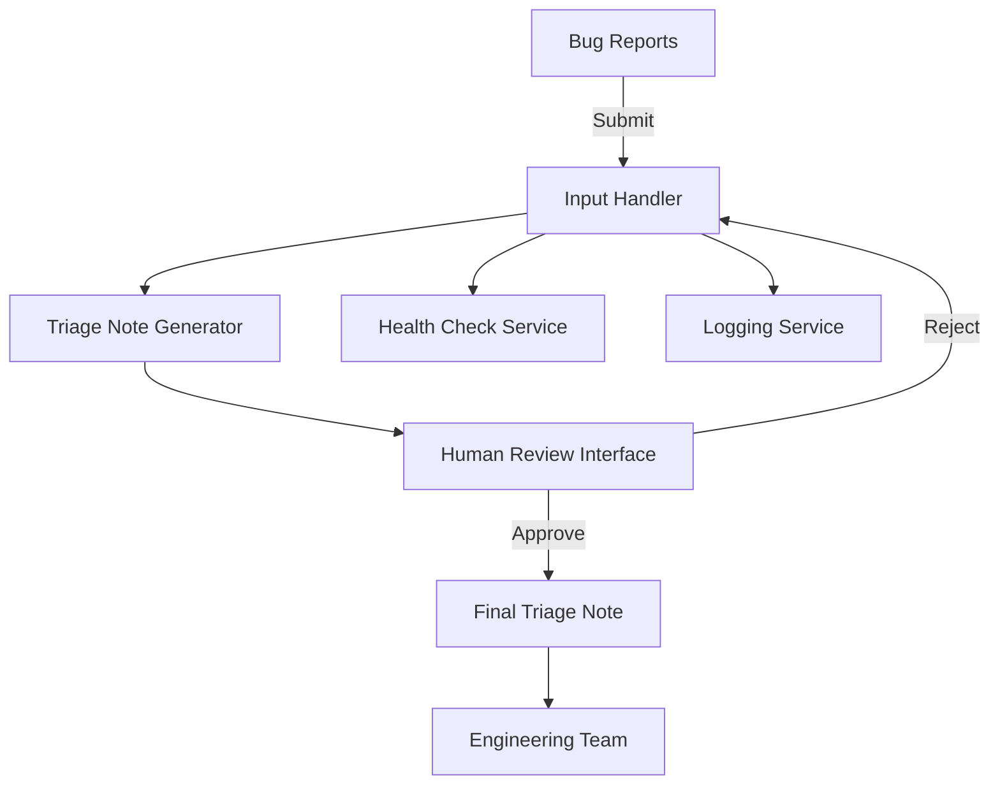

# Lightweight Architecture Document

## Overview
This document outlines the architecture for an automated system designed to convert bug reports from Support and QA teams into structured triage notes in JSON format. The system aims to improve efficiency by reducing the time engineers spend rewriting bug reports, while ensuring a reliable and secure output for integration with existing tools.

## Components
1. **Input Handler**: Accepts bug reports from Support and QA teams.
2. **Triage Note Generator**: Processes the input and generates structured triage notes in JSON format.
3. **Human Review Interface**: Allows designated team members to review and approve generated notes before they are finalized.
4. **Health Check Service**: Monitors system health and availability.
5. **Logging Service**: Captures logs for debugging and auditing purposes.
6. **CI/CD Integration**: Ensures the system is tested and deployed in a continuous integration environment.

## API Contract
### Endpoints
- **POST /bug-reports**
  - **Request Body**: 
    ```json
    {
      "report": "string"
    }
    ```
  - **Response**: 
    ```json
    {
      "status": "success",
      "triage_note": {
        "severity": "string",
        "probable_component": "string",
        "root_cause_hypothesis": "string",
        "recommended_next_step": "string",
        "test_plan": "string",
        "rollback_plan": "string",
        "release_note": "string"
      }
    }
    ```

- **GET /health**
  - **Response**: 
    ```json
    {
      "status": "healthy"
    }
    ```

## Data Flow
1. Bug reports are submitted via the `/bug-reports` endpoint.
2. The Input Handler processes the report and forwards it to the Triage Note Generator.
3. The Triage Note Generator creates a structured triage note in JSON format.
4. The generated note is sent to the Human Review Interface for approval.
5. Once approved, the note is stored and can be accessed by the Engineering team.

## Failure Modes and Mitigations
- **Input Validation Failure**: Ensure robust validation of incoming bug reports to prevent malformed data.
- **Human Review Delays**: Implement reminders and a streamlined review process to minimize bottlenecks.
- **System Downtime**: Use load balancers and redundancy to maintain 99.9% uptime.

## Test Strategy
- Unit tests for each component to ensure individual functionality.
- Integration tests to verify the interaction between components.
- User acceptance testing with Support and QA teams to validate the system meets requirements.
- Load testing to ensure scalability under increased submissions.

## Rollout and Rollback
### Rollout Plan
1. Develop the initial version with core functionalities.
2. Conduct internal testing with a small group of users.
3. Gather feedback and make adjustments.
4. Roll out to the Support team, followed by the QA team in phases.
5. Monitor performance and user feedback for continuous improvement.

### Rollback Plan
- If issues arise during rollout, revert to the previous stable version of the system.
- Maintain a backup of the last known good configuration to facilitate quick recovery.

## Mermaid Diagram


This architecture document provides a high-level overview of the system's design and implementation strategy, ensuring that all stakeholders are aligned on the objectives and processes involved in automating the bug report triage process.
